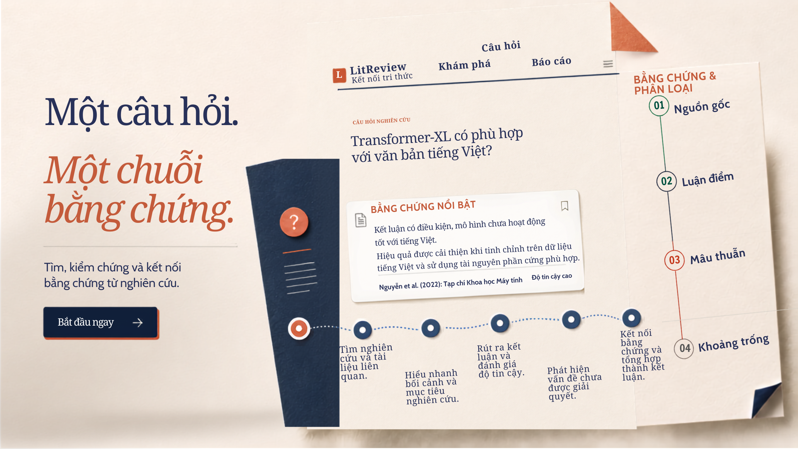

<p align="center">
  
</p>

# LitReview

· Nền tảng hỗ trợ nghiên cứu học thuật dựa trên bằng chứng.

> LitReview giúp nhóm nghiên cứu tìm kiếm, tổng hợp và kiểm duyệt tài liệu học thuật; phát hiện research gap; rà soát tài liệu PDF; và thử nghiệm giả thuyết trong một môi trường tách biệt, có thể tái lập.

---

## 🧩 Vấn đề

Thực hiện literature review chất lượng là một quy trình tốn thời gian và dễ thiếu sót:

- Nhà nghiên cứu phải tìm kiếm, đọc, đối chiếu và tổng hợp một lượng lớn paper từ nhiều nguồn.
- Các kết luận sinh bởi AI có nguy cơ thiếu bằng chứng hoặc dẫn chiếu sai nếu không có bước kiểm chứng và phê duyệt.
- Research gap thường khó nhìn thấy khi tài liệu bị phân tán theo từng paper, chủ đề hoặc phương pháp.
- Việc rà soát bản thảo PDF, citation và cách diễn đạt vẫn cần nhiều thao tác thủ công.
- Thử nghiệm giả thuyết hoặc phân tích dữ liệu không nên làm thay đổi corpus và graph dữ liệu gốc trước khi được reviewer thông qua.

## 💡 Giải pháp

LitReview đặt bằng chứng, khả năng truy vết và người duyệt ở trung tâm quy trình.

|  | Tính năng | Tóm tắt |
| --- | --- | --- |
| 🔎 | **Literature Review Agent** | Lập kế hoạch tìm kiếm, thu thập tài liệu, tổng hợp chủ đề, claim, evidence và báo cáo theo background job. |
| 🧭 | **Research Gap Detection** | Phát hiện câu hỏi chưa được trả lời, điểm mâu thuẫn và hướng nghiên cứu tiềm năng từ corpus đã kiểm chứng. |
| 📄 | **Document Review** | Upload PDF, đọc nội dung, tạo annotation, giải thích và đề xuất chỉnh sửa có kiểm soát. |
| 💬 | **Research Copilot** | Hội thoại theo project, làm việc với nguồn, lưu memory và đưa action proposal chờ phê duyệt. |
| 🧪 | **Research Sandbox** | Không gian tách biệt cho hypothesis, graph overlay và data analysis; mọi hand-off đều đi qua reviewer gate. |

## 🎯 Đối tượng sử dụng

| Đối tượng | Nhu cầu |
| --- | --- |
| **Nhà nghiên cứu / sinh viên** | Tìm, đọc và tổng hợp tài liệu nhanh hơn nhưng vẫn truy được nguồn và bằng chứng. |
| **Reviewer / giảng viên** | Kiểm tra kết quả, đưa phản hồi và phê duyệt các bước quan trọng trước khi áp dụng. |
| **Chủ project nghiên cứu** | Quản lý thành viên, phiên bản báo cáo, lời mời reviewer và tiến độ review trong cùng một workspace. |

## 🛠️ Tech Stack

**Backend & AI**

| Badge | Vai trò |
| --- | --- |
|  | Ngôn ngữ backend và worker |
|  | REST API, OpenAPI và middleware |
|  | Điều phối workflow literature review và research gap |
|  | Schema, validation và cấu hình |

**Frontend, dữ liệu & hạ tầng**

| Badge | Vai trò |
| --- | --- |
|  | Web application với App Router |
|  | Giao diện người dùng |
|  | Nguồn dữ liệu chính và LangGraph checkpoints |
|  | Worker wake-up và cache trạng thái job |
|  | Chỉ mục semantic search có thể tái tạo |
|  | Môi trường local và deployment stack |

## 🚀 Quick Start

Yêu cầu: Docker Desktop (hoặc Docker Engine) và Docker Compose v2.

### 1. Tạo biến môi trường

```bash
cp .env.example .env
```

Trên PowerShell:

```powershell
Copy-Item .env.example .env
```

Trong `.env`, cấu hình tối thiểu:

- Một LLM provider, ví dụ `OPENAI_API_KEY` và `LLM_PROVIDER=openai`.
- `NEXT_PUBLIC_CLERK_PUBLISHABLE_KEY` và `CLERK_SECRET_KEY` nếu dùng đăng nhập Clerk.
- `OPENALEX_EMAIL` để sử dụng OpenAlex polite pool.

### 2. Khởi động stack local

```bash
docker compose up --build
```

| Dịch vụ | Địa chỉ |
| --- | --- |
| Frontend | <http://localhost:3000> |
| API health | <http://localhost:8000/health> |
| OpenAPI / Swagger | <http://localhost:8000/docs> |
| Qdrant dashboard | <http://localhost:6333/dashboard> |

Theo dõi service:

```bash
docker compose ps
docker compose logs -f backend worker frontend
```

Dừng stack mà vẫn giữ dữ liệu trong `data/`:

```bash
docker compose down
```

## ⚙️ Phát triển không dùng Docker

Chế độ này yêu cầu bạn tự cung cấp PostgreSQL, Redis và Qdrant.

### Backend

```bash
uv sync
cp .env.example .env
uv run uvicorn src.main:app --reload --host 0.0.0.0 --port 8000
```

Với virtual environment hiện có trên Windows:

```powershell
.\.venv\Scripts\Activate.ps1
uvicorn src.main:app --reload --host 0.0.0.0 --port 8000
```

Đặt `WORKER_MODE=embedded` nếu muốn API chạy worker trong cùng tiến trình. Docker Compose dùng external worker riêng.

### Frontend

```bash
cd frontend
npm ci
npm run dev
```

Khi chạy frontend ngoài Docker, đặt `BACKEND_API_BASE_URL=http://localhost:8000/api/v1`.

## 🧪 Kiểm thử & chất lượng

```bash
# Python tests
pytest tests/ -v

# Lint và format Python
ruff check src/ tests/
ruff format --check src/ tests/

# Kiểm tra type frontend
cd frontend && npm run lint

# Browser E2E tests
cd frontend && npm run test:e2e
```

Các benchmark agent:

```bash
python -m benchmarks selftest
python -m benchmarks run --only pos_01,neg_01 --label quick
```

## 📂 Cấu trúc dự án

```text
ai-literature-review/
├── src/                                  # Backend FastAPI và logic nghiệp vụ cốt lõi
│   ├── agents/                           # LangGraph Workflows dạng mô-đun
│   │   ├── litreview/                    # Literature Review Agent (domain, workflow, prompts, tools, repos)
│   │   ├── research_gap/                 # Research Gap Detection Agent (domain, workflow, application)
│   │   ├── document_review/              # Document Review Service (PDF parsing, annotation, critique)
│   │   └── research_sandbox/             # Gateway & Adapter tích hợp với Research Sandbox
│   ├── api/
│   │   └── routers/                      # REST API endpoints (review, copilot, document review, sandbox)
│   ├── db/                               # Database models (SQLAlchemy) và kết nối session
│   ├── models/                           # Pydantic schemas (request/response models)
│   ├── services/                         # LLM provider, search, jobs, vector store, auth & helpers
│   ├── research_sandbox_service/         # Dịch vụ Research Sandbox cô lập (execution, hypotheses, analysis)
│   │   ├── sandbox_service/              # FastAPI control API, worker, profiling & repositories
│   │   ├── sandbox_runtime/              # Isolated execution runtime (Docker/Native containers)
│   │   ├── migrations/                   # Sandbox database schema migrations
│   │   ├── docker-compose.sandbox.yml    # Standalone compose stack cho Sandbox
│   │   └── tests/                        # Tests (unit, integration, security, e2e) của Sandbox
│   ├── validation/                       # Cơ chế Grounding, citation verification & claim validation
│   ├── config.py                         # Application configuration từ biến môi trường
│   ├── main.py                           # FastAPI application entry point
│   └── worker_main.py                    # Background job worker entry point
├── frontend/                             # Giao diện Web (Next.js 16 / React 19 / Tailwind / CSS)
│   ├── app/                              # Next.js App Router: routes, components, layouts, styling
│   ├── e2e/                              # Playwright browser end-to-end tests
│   └── package.json                      # Frontend dependencies & npm scripts
├── alembic/                              # Core PostgreSQL schema migrations
├── tests/                                # Test suite tổng thể cho backend và agents
│   ├── test_agents/                      # Unit & integration tests cho các agent workflows
│   ├── test_api/                         # FastAPI route tests
│   ├── test_services/                    # Unit tests cho các services (search, vector, ingestion)
│   ├── test_validation/                  # Validation & citation verification tests
│   └── v2/                               # V2 API, E2E và contract test suites
├── benchmarks/                           # Datasets và benchmark scripts đánh giá năng lực agent
├── deploy/                               # Cấu hình triển khai & scripts Docker/Nginx
├── docs/                                 # Hệ thống tài liệu dự án
│   ├── architecture/                     # Tài liệu kiến trúc hệ thống & agent state graphs
│   ├── design/                           # Thiết kế chi tiết hệ thống
│   ├── operations/                       # Hướng dẫn vận hành, deploy và worker runtime
│   └── product/                          # Product specs, workflows & PRD
├── eval/                                 # Kịch bản và báo cáo kết quả đánh giá hệ thống
├── scripts/                              # Scripts hỗ trợ setup VPS, runtime và dev smoke tests
│   └── dev/                              # Tiện ích dev local (kiểm tra schema DB, smoke test API)
├── supabase/                             # SQL migrations cho Supabase database
├── docker-compose.yml                    # Local multi-service compose stack (Full development)
├── docker-compose-production.yml         # Production compose stack
├── Dockerfile                            # Backend container image build definition
├── pyproject.toml                        # Python project configuration & dependencies
├── Makefile                              # Phím tắt lệnh kiểm thử và chạy (Unix/WSL)
├── .env.example                          # File mẫu cấu hình biến môi trường
└── README.md                             # Tài liệu tổng quan dự án
```

## 🔐 Cấu hình & bảo mật

Xem toàn bộ biến môi trường trong [`.env.example`](.env.example). Không commit `.env`, API key, `CLERK_SECRET_KEY`, chuỗi kết nối database hoặc secret của Sandbox.

| Nhóm | Biến chính |
| --- | --- |
| LLM | `LLM_PROVIDER`, `OPENAI_API_KEY`, `GOOGLE_API_KEY`, `OLLAMA_API_KEY`, `OPENROUTER_API_KEY` |
| Xác thực | `NEXT_PUBLIC_CLERK_PUBLISHABLE_KEY`, `CLERK_SECRET_KEY`, `CLERK_ISSUER`, `CLERK_JWKS_URL` |
| Database | `DATABASE_URL`, `PRODUCT_DATABASE_URL`, `POSTGRES_HOST_PORT` |
| Job runtime | `WORKER_MODE`, `RUNTIME_ROLE`, `REDIS_ENABLED`, `REDIS_URL` |
| Vector search | `QDRANT_ENABLED`, `QDRANT_URL`, `QDRANT_EMBEDDING_PROVIDER` |
| Sandbox | `SANDBOX_ENABLED` và các cờ `SANDBOX_*_ENABLED` |

Sandbox hoạt động fail-closed khi `SANDBOX_ENABLED=false`, nên luồng review cốt lõi vẫn chạy bình thường khi Sandbox chưa được cấu hình.

## 📚 Tài liệu

- [Tổng quan kiến trúc](docs/architecture/ARCHITECTURE.md)
- [Thiết kế hệ thống](docs/design/SYSTEM_DESIGN.md)
- [Luồng thực thi LitReview](docs/architecture/AGENT_STATE_GRAPH.md)
- [Vận hành worker](docs/operations/WORKER_RUNTIME.md)
- [Triển khai Ubuntu VPS](docs/operations/DEPLOY_UBUNTU_VPS_NATIVE.md)
- [Research Sandbox](src/research_sandbox_service/README.md)
