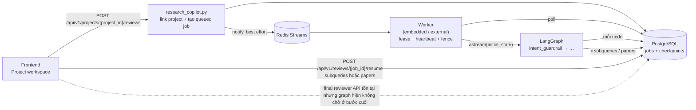
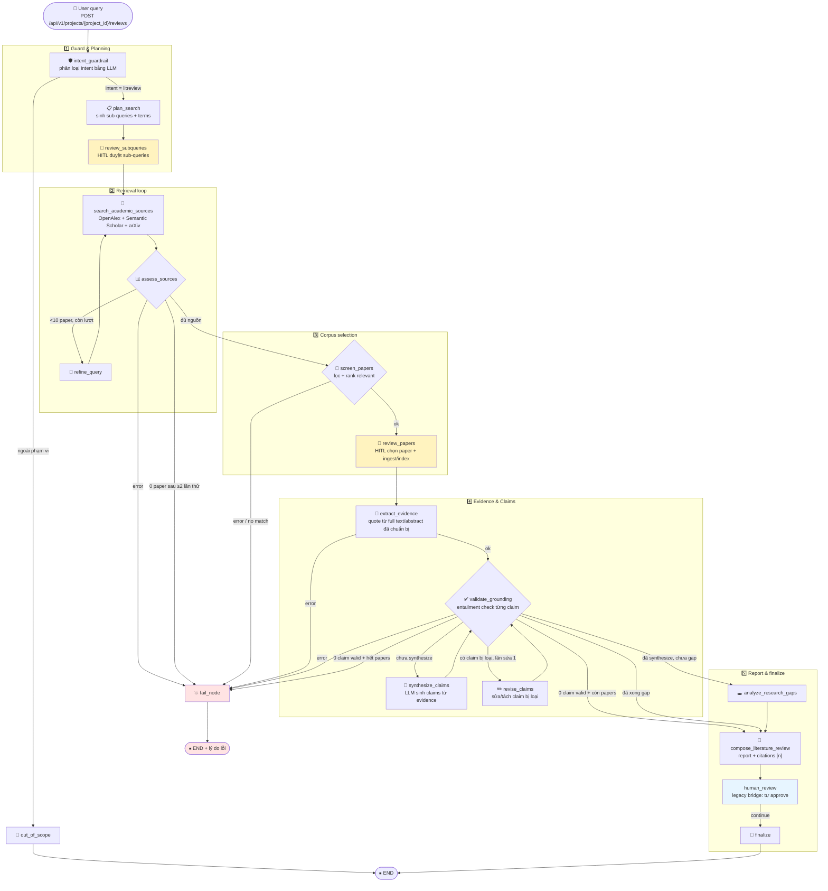

# LitReview Agent — Luồng thực thi chính

Tài liệu này là nguồn mô tả chuẩn cho luồng literature review trong `src/agents/graph.py`; các nhánh điều kiện lấy từ hàm `after_*`. Ảnh render (nếu cần) nằm tại `docs/architecture/agent_input_flow.png`.

## Luồng bao quanh graph (không nằm trong LangGraph)

- Graph được compile với `AsyncPostgresSaver` trong `src/services/jobs.py` và chạy bằng `astream(..., stream_mode="updates")`.
- Hai HITL stage đang hoạt động là `subqueries` và `papers`; response được lưu
  trong PostgreSQL rồi worker resume checkpoint.
- `human_review_node` hiện tự đặt `hitl_decision="approve"` cho cả `review` và
  `autonomous`, đúng với test `test_final_review_is_approved_automatically`.
  Project-scoped final reviewer API/schema vẫn còn để tương thích, nhưng không
  phải một gate có thể đạt tới sau khi graph hoàn tất. Đây là implementation gap,
  không được trình bày như chức năng đã cưỡng chế.

## State graph đầy đủ (18 node, 8 nhánh điều kiện)

## Bản đồ node → code

| Node | File | Vai trò |
|---|---|---|
| `intent_guardrail` | `src/agents/nodes/litreview.py` | LLM phân loại intent; chặn query ngoài phạm vi |
| `plan_search` / `review_subqueries` | `litreview.py` | Sinh sub-queries, HITL duyệt (review mode) |
| `search_academic_sources` | `litreview.py` + `src/services/academic_search.py` | Gọi OpenAlex / Semantic Scholar / arXiv |
| `assess_sources` / `refine_query` | `litreview.py` | Đánh giá số lượng nguồn, refine nếu <10 paper (tối đa 2 lần) |
| `screen_papers` / `review_papers` | `litreview.py` + `paper_ingestion.py` / `vector_store.py` | Lọc relevant, HITL chọn corpus, tải OA full text khi có và index Qdrant |
| `extract_evidence` | `litreview.py` | Trích quote từ full-text context đã chuẩn bị hoặc abstract fallback |
| `synthesize_claims` / `revise_claims` | `litreview.py` | Sinh / sửa claims gắn quote |
| `validate_grounding` | `litreview.py` | Entailment check từng claim so với quote gốc |
| `analyze_research_gaps` | `litreview.py` | Phát hiện research gap từ claims |
| `compose_literature_review` | `litreview.py` | Tổng hợp report + citation marker `[n]` |
| `human_review` / `finalize` / `fail` | `litreview.py` | Tự approve ở runtime hiện tại, hoàn tất, hoặc kết thúc lỗi có lý do |

## Quy tắc routing (`after_*` trong graph.py)

- `after_intent_guardrail`: chỉ `intent == "litreview"` mới vào pipeline, ngược lại `out_of_scope` → END.
- `after_assess_sources`: `error` hoặc 0 paper sau ≥2 lần thử → `fail`; <10 paper còn lượt → `refine_query` → quay lại search; đủ → `screen_papers`.
- `after_screen_papers`: corpus rỗng sau lọc → `fail` terminal (không cho report rỗng gây hiểu lầm).
- `after_validate_grounding` (node phân nhánh nhiều nhất):
  - 0 claim valid nhưng còn papers → vẫn `compose_literature_review` (report minh bạch giới hạn evidence);
  - có claim bị loại và chưa sửa lần nào → `revise_claims` → quay lại validate;
  - chu trình synthesize → validate → gap → compose tạo **2 vòng** qua `validate_grounding`.
- `after_human_review` vẫn có nhánh `request_changes` để tương thích checkpoint
  cũ, nhưng state mới luôn nhận `approve` từ `human_review_node` và đi thẳng tới
  `finalize`.

## Evidence và research gap trong luồng chính

`synthesize_claims` tạo theme và `potential_gaps` từ corpus đã được kiểm tra grounding. `analyze_research_gaps` chỉ phân loại và chuẩn bị thông tin review; nó không được phép khẳng định một chủ đề hoàn toàn chưa từng được nghiên cứu ngoài corpus hiện có.

Mỗi gap cần giữ phạm vi, evidence quote và truy vấn counter-search. API/UI có
thao tác review gap riêng sau khi report tồn tại; graph literature review hiện
không chờ reviewer ở bước cuối. Với chi tiết của workflow research-gap độc lập,
xem [RESEARCH_GAP_FLOW.md](RESEARCH_GAP_FLOW.md).
