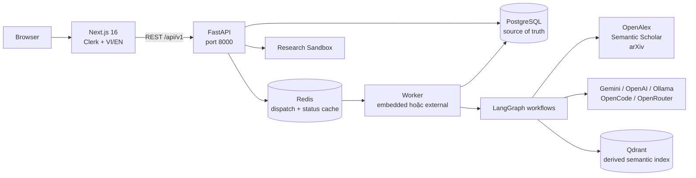

# LitReview Agent — Kiến trúc hệ thống hiện tại

> Cập nhật theo mã nguồn ngày 2026-09-01. Khi tài liệu khác mâu thuẫn với file này, ưu tiên `src/`, `docker-compose.yml`, `.env.example` và migration đang chạy.

## Tổng quan

LitReview Agent là ứng dụng web hỗ trợ tìm tài liệu, tạo literature review có dẫn chứng, phân tích research gap, cộng tác với reviewer và phân tích dữ liệu trong sandbox có kiểm soát.

## Thành phần chính

| Thành phần | Mã nguồn | Trách nhiệm |
|---|---|---|
| Frontend | `frontend/app/` | Landing, dashboard, project workspace, report, reviewer, document review và sandbox UI |
| API | `src/main.py`, `src/api/routers/` | REST API, auth context, validation và điều phối use case |
| Literature-review workflow | `src/agents/graph.py` | StateGraph 18 node, retrieval, evidence, grounding, synthesis; HITL ở sub-query và paper selection |
| Research-gap workflow | `src/agents/research_gap_graph.py` | Detector, verification, counter-evidence, scoring và synthesis |
| Durable runtime | `src/services/worker_runtime.py`, `src/services/jobs.py` | Lease, heartbeat, execution fence, chạy/resume LangGraph |
| Persistence | `src/services/repositories/` | PostgreSQL cho job, report, project, actor, conversation, memory và checkpoint |
| Academic search | `src/services/academic_search.py` | Tìm song song OpenAlex, Semantic Scholar và arXiv, normalize và deduplicate |
| Retrieval | `src/services/paper_ingestion.py`, `src/services/vector_store.py` | Tải/parse paper và index semantic trên Qdrant |
| Auth/collaboration | `src/services/clerk_auth.py`, `research_copilot.py` | Clerk, membership, invitation, assignment và reviewer decision |
| Sandbox | `src/research_sandbox_service/`, `src/api/routers/sandbox*.py` | Phiên phân tích dữ liệu được kiểm soát và adoption workflow |

## Dữ liệu và background processing

- PostgreSQL là source of truth duy nhất cho application data và LangGraph checkpoints. Runtime không dùng SQLite.
- Redis chỉ tăng tốc wake-up worker và đọc status; mất Redis sẽ fallback về PostgreSQL polling.
- Qdrant là index có thể dựng lại, không sở hữu job, report hay reviewer decision.
- Local development mặc định chạy worker embedded cùng API.
- Docker Compose tách `backend` và `worker`; cả hai dùng chung PostgreSQL và Redis.

## Luồng AI

Luồng literature review chi tiết nằm tại [AGENT_STATE_GRAPH.md](AGENT_STATE_GRAPH.md). Luồng research gap độc lập nằm tại [RESEARCH_GAP_FLOW.md](RESEARCH_GAP_FLOW.md).

Các nguyên tắc bắt buộc:

1. Không có evidence hợp lệ thì không tạo factual claim.
2. Metadata, DOI và URL phải đến từ academic provider, không từ LLM.
3. Search, retry, revision và tool execution đều có giới hạn.
4. Reviewer API lưu decision với actor và project scope; final reviewer gate chưa được graph hiện tại cưỡng chế.
5. Dữ liệu Qdrant/Redis không thay thế PostgreSQL.

## Runtime và triển khai

| Môi trường | API/worker | Hạ tầng |
|---|---|---|
| Local | `WORKER_MODE=embedded` | PostgreSQL; Redis/Qdrant có thể bật theo nhu cầu |
| Docker Compose | API và worker tách process | PostgreSQL, Redis, Qdrant và frontend |
| Production | API/worker cùng cấu hình backend | PostgreSQL bắt buộc; Redis/Qdrant theo deployment |

Backend được khai báo Python `>=3.12` trong `pyproject.toml` và CI dùng 3.12. `Dockerfile` hiện vẫn dùng Python 3.11; đây là lệch cấu hình cần sửa ở image, không phải kiến trúc đích.

## Nguồn đối chiếu

- Cấu hình: `src/config.py`, `.env.example`
- Composition root: `src/main.py`
- Container runtime: `docker-compose.yml`
- Worker: [WORKER_RUNTIME.md](../operations/WORKER_RUNTIME.md)
- API contract: [README_technical_contract.md](../reference/README_technical_contract.md)
