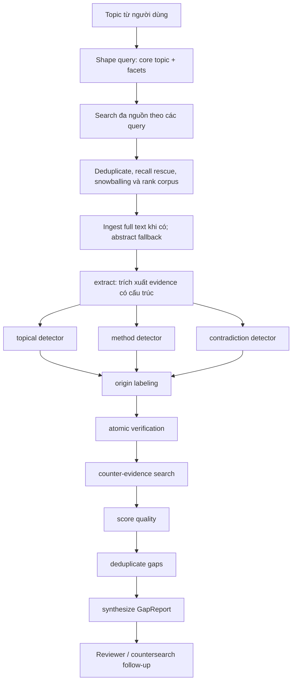

# Research Gap Workflow

Tài liệu này mô tả workflow research-gap hiện tại, dựa trên `src/services/research_gap_jobs.py` và `src/agents/research_gap_graph.py`. Đây là workflow **độc lập** với graph literature review chính: job service tạo corpus trước, sau đó `ResearchGapGraph` chỉ phân tích corpus được cấp và không dùng `AgentState` của literature review.

## Điểm vào và phạm vi

- API: `POST /projects/{project_id}/research-gaps` tạo job có `workflow_type = research_gap`.
- Job được worker chạy qua `ResearchGapJobService`; API không chạy graph dài trong request.
- Corpus dùng dữ liệu từ OpenAlex, Semantic Scholar và arXiv qua `AcademicSearchService`; số query tối đa, kích thước corpus và số paper snowballing lấy từ cấu hình `research_gap_*`.
- Kết quả chỉ là gap **trong phạm vi corpus thu thập được**, không phải kết luận rằng một chủ đề chưa từng được nghiên cứu trên toàn bộ lĩnh vực.

## Luồng end-to-end

## Các node của `ResearchGapGraph`

| Node | Vai trò | Guardrail chính |
| --- | --- | --- |
| `extract` | Tách topics, methodology, dataset, metrics, claims và limitations từ từng paper. | Source text là dữ liệu, không phải instruction; không tạo fact mới. |
| `topical_detector` | Tìm ứng dụng, population, language hoặc task được bao phủ ít trong corpus. | Mỗi candidate phải có quote nguyên văn. |
| `method_detector` | Tìm tổ hợp method, dataset, metric hoặc evaluation chưa được khai thác nhiều. | Chỉ suy luận từ structured evidence đã trích xuất. |
| `contradiction_detector` | Tìm mâu thuẫn rõ ràng giữa các claim. | Phải có evidence từ ít nhất hai paper. |
| `origin_labeling` | Gắn nguồn gốc `explicit`, `limitation` hoặc `inferred`. | Gap suy luận từ corpus cần evidence của ít nhất hai paper. |
| `verifier` | Chia candidate thành atomic subclaims và kiểm tra entailment. | Loại candidate `unsupported` hoặc `uncertain`; quote phải có trong source. |
| `counter_evidence` | Tìm paper phản chứng hoặc thu hẹp gap. | Chỉ chấp nhận quote trực tiếp giải quyết candidate. |
| `quality_scoring` | Tính evidence, novelty, feasibility và quality score. | Có counter-evidence sẽ giảm điểm quality/evidence. |
| `deduplicate` | Gộp candidate có mức chồng lấp evidence cao. | Giữ lại tất cả quote hợp lệ để không mất audit trail. |
| `synthesize` | Tạo `GapReport` và coverage theo paper. | Chỉ output candidate đã qua verification và deduplication. |

## Kết quả và review

Mỗi gap trả về có `gap_id`, `scope_statement`, `gap_type`, coverage theo paper, evidence/counter-evidence, `counter_search_query`, rationale cho reviewer, suggested method và falsification condition. `confidence` được suy ra từ grounding; `verification_status` là `grounded` hoặc `reviewed` khi có counter-evidence trực tiếp.

Reviewer vẫn là người quyết định cách dùng kết quả. Khi cần bằng chứng bổ sung, endpoint counter-search và review gap trong `src/api/routers/research_copilot.py` tạo luồng theo dõi riêng thay vì coi gap là kết luận cuối.

## Quan hệ với literature review

Luồng literature review chính có node `analyze_research_gaps` để đưa gap candidates vào report. Workflow này được gọi riêng khi người dùng cần chạy research-gap job có corpus và counter-evidence pipeline chuyên biệt. Luồng chính được mô tả tại [AGENT_STATE_GRAPH.md](AGENT_STATE_GRAPH.md).
