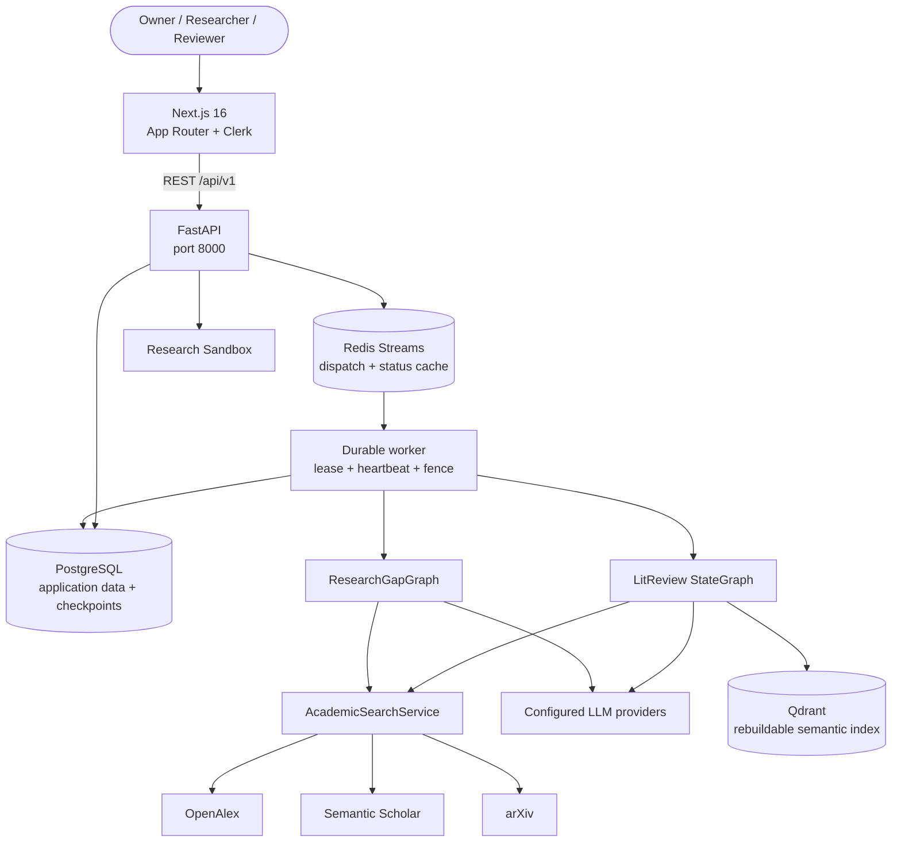

# Architecture Diagram

> Sơ đồ rút gọn của hệ thống đang chạy. Chi tiết trách nhiệm và dữ liệu xem tại [ARCHITECTURE.md](ARCHITECTURE.md).

| Layer | Công nghệ hiện tại |
|---|---|
| Frontend | Next.js 16, React 19, TypeScript 5 |
| Backend | FastAPI, Python 3.12 theo project/CI |
| Workflow | LangGraph |
| Database | PostgreSQL |
| Queue/cache | Redis Streams và status cache; PostgreSQL vẫn authoritative |
| Vector retrieval | Qdrant |
| Academic sources | OpenAlex, Semantic Scholar, arXiv |
| Authentication | Clerk |

Không sử dụng ChromaDB hay SQLite trong runtime hiện tại.
