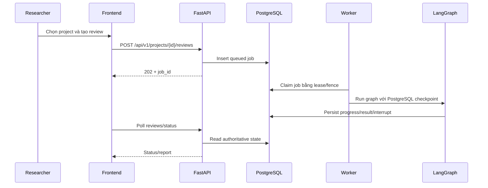

# Basic Design

> Thiết kế logic của hệ thống hiện tại, cập nhật 2026-09-01.

## 1. Nguyên tắc

- Evidence-first: không có nguồn thì không có factual claim.
- PostgreSQL-first: job, report, review và checkpoint phải bền vững trước khi trả trạng thái.
- Derived infrastructure: Redis và Qdrant tăng tốc nhưng không phải source of truth.
- Human control: reviewer decision và mutation nhạy cảm phải qua API có actor/project scope.
- Bounded execution: mọi loop, retry, search, revision và sandbox execution đều có giới hạn.

## 2. Module decomposition

| Module | Source | Trách nhiệm |
|---|---|---|
| Web application | `frontend/app/` | Landing, auth, dashboard, project, report, reviewer, document review, sandbox |
| API composition | `src/main.py` | Lifespan, middleware và router registration |
| Literature review API | `src/api/routers/literature_reviews.py` | Legacy/current review endpoints và metrics |
| Project/Copilot API | `src/api/routers/research_copilot.py` | Project, collaboration, gap, conversation, memory và action APIs |
| Document review API | `src/api/routers/document_reviews.py` | Upload/edit/review/explain/rewrite/apply |
| Sandbox API | `src/api/routers/sandbox*.py` | Public project-scoped API và internal control boundary |
| Job service/runtime | `src/services/jobs.py`, `worker_runtime.py` | Compile graph, claim/execute/resume/recover job |
| Repositories | `src/services/repositories/` | PostgreSQL queries và transaction boundaries |
| Academic retrieval | `src/services/academic_search.py` | Multi-source search, normalize, deduplicate |
| Vector retrieval | `paper_ingestion.py`, `vector_store.py` | Full-text ingestion, embedding và Qdrant query |

## 3. Luồng tạo literature review

Ở local, worker có thể chạy embedded. Trong Docker, API và worker là process riêng; Redis đánh thức worker nhưng PostgreSQL vẫn quyết định job nào được claim.

## 4. Luồng reviewer

1. Researcher tạo invitation cho một review.
2. Backend lưu invitation/token và có thể gửi email qua Resend.
3. Reviewer accept, nhận project membership và review assignment phù hợp.
4. Reviewer gửi decision; backend kiểm tra assignment/actor và lưu audit data.
5. Job được resume nếu cần sửa hoặc finalize khi approve.

## 5. Luồng research gap

`POST /projects/{project_id}/research-gaps` tạo durable job. Service chuẩn bị corpus, chạy `ResearchGapGraph`, lưu gap candidate và cho phép countersearch/reviewer verdict qua project API. Chi tiết: [RESEARCH_GAP_FLOW.md](../architecture/RESEARCH_GAP_FLOW.md).

## 6. Logical data ownership

| Data | Authoritative store |
|---|---|
| Job, checkpoint, report, review, evaluation | PostgreSQL |
| Project, actor, membership, invitation | PostgreSQL |
| Conversation, message, memory, action proposal | PostgreSQL |
| Worker notification/status cache | Redis, fallback PostgreSQL |
| Embedding và semantic index | Qdrant, rebuildable |
| Downloaded PDF | Temporary/rebuildable storage |
| Sandbox artifact | Sandbox PostgreSQL/object storage theo cấu hình |

## 7. Error và observability

- API validate request bằng Pydantic và trả HTTP status theo contract.
- Worker persist failure vào job thay vì chỉ log exception.
- Structured log gắn `request_id`, `job_id`, `run_id`, và `worker_id` khi có.
- Redis/Qdrant/provider lỗi có fallback theo loại; PostgreSQL lỗi là lỗi authoritative và không được che giấu.

## 8. Configuration

Nguồn chuẩn là `src/config.py` và `.env.example`. Các biến nền tảng gồm `DATABASE_URL`, `WORKER_MODE`, `RUNTIME_ROLE`, `REDIS_*`, `QDRANT_*`, Clerk, LLM provider keys và academic provider settings.

## 9. Test mapping

| Boundary | Test cần có |
|---|---|
| Router/schema/auth | API/contract tests |
| Repository/migration | PostgreSQL integration tests |
| Worker lease/recovery | Durable runtime tests |
| Graph routing | Node/conditional-edge tests |
| Academic adapters | Mocked provider/error tests |
| Frontend | lint, build và E2E các flow chính |
| Sandbox | PostgreSQL + Docker runtime suite trong CI |
