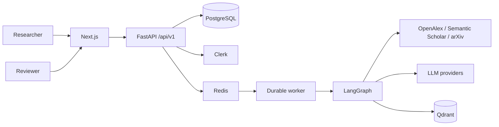

# System Architecture

> Living design document, đối chiếu với code ngày 2026-09-01. Kiến trúc tổng quan chuẩn nằm tại [docs/architecture/ARCHITECTURE.md](../architecture/ARCHITECTURE.md).

## 1. Phạm vi

Hệ thống hiện gồm literature-review workflow, research-gap workflow, project workspace/Copilot, reviewer collaboration, document review và research sandbox. Đây không còn là MVP SQLite/OpenAlex-only.

## 2. System context

## 3. Containers và trách nhiệm

| Container/process | Trách nhiệm | Dữ liệu sở hữu |
|---|---|---|
| Next.js frontend | Routing, VI/EN UI, Clerk session, polling và interaction | Browser state; không sở hữu dữ liệu nghiệp vụ |
| FastAPI API | Auth, request validation, project/reviewer/document/sandbox APIs | Không giữ job trong memory làm source of truth |
| Worker | Claim job, heartbeat, chạy/resume graph, ghi progress/result | Không sở hữu lâu dài; ghi PostgreSQL |
| PostgreSQL | Application data và LangGraph checkpoints | Source of truth |
| Redis | Worker notification và short-lived status cache | Dữ liệu tăng tốc, có thể mất và phục hồi |
| Qdrant | Full-text/abstract embeddings phục vụ semantic retrieval | Derived index có thể dựng lại |
| Sandbox services | Phiên phân tích và artifact được kiểm soát | PostgreSQL/object storage theo sandbox config |

## 4. Functional capabilities hiện có

- Literature review StateGraph 18 node, có bounded retry, evidence grounding và hai HITL gate đang hoạt động ở sub-query/paper selection.
- Tìm paper từ OpenAlex, Semantic Scholar và arXiv.
- Research-gap job độc lập với detector, verifier, counter-evidence và scoring.
- Project, membership, Clerk identity, invitation và reviewer assignment.
- Conversation, memory, action proposal, report version và comparison matrix.
- Document review, suggestion, explain/rewrite và apply flow.
- Research sandbox có capability gate và internal adoption API.

Final reviewer API/schema và invitation/assignment đã có, nhưng
`human_review_node` hiện tự approve ở cả hai execution mode. Vì graph không dừng
ở bước cuối, final reviewer gate chưa phải capability được runtime cưỡng chế.

## 5. Data architecture

PostgreSQL lưu job, report, review/evaluation, project/actor, conversation/message, memory, invitation, version và checkpoint. `DATABASE_URL` là PostgreSQL-only; `PRODUCT_DATABASE_URL` có thể tách product data nhưng mặc định dùng chung.

Redis không quyết định ownership hay trạng thái cuối của job. Qdrant không lưu business record. PDF tải về là cache/rebuildable input; structured artifact và metadata mới là dữ liệu ứng dụng.

## 6. Reliability và concurrency

- Worker dùng row lease, heartbeat và execution fence để tránh hai worker cùng hoàn tất một job.
- Redis lỗi sẽ fallback về PostgreSQL scan/status read.
- Job graph dùng PostgreSQL checkpointer để resume sau restart.
- Provider calls có timeout/retry; search/revision/counter-search đều bounded.
- Docker Compose chạy API và worker thành hai process độc lập.

## 7. Security

- Production xác minh Clerk bearer token; bootstrap session chỉ dành cho development/test.
- Project/membership/review assignment được kiểm tra ở backend.
- Provider key, database URL, Redis/Qdrant credential và email key chỉ ở backend environment.
- Sandbox dùng capability checks và internal API boundary; không để browser gọi internal routes.

## 8. Technology baseline

| Layer | Baseline |
|---|---|
| Frontend | Next.js 16.2, React 19.2, TypeScript 5.8 |
| Backend | FastAPI; Python >=3.12 trong project và CI |
| Workflow | LangGraph + PostgreSQL checkpointer |
| Persistence | PostgreSQL, SQLAlchemy/psycopg, Alembic |
| Dispatch/cache | Redis |
| Retrieval | Qdrant |

`Dockerfile` backend còn dùng Python 3.11 và cần được đồng bộ với `pyproject.toml`; tài liệu này không coi image đó là baseline hợp lệ.

## 9. Tài liệu chi tiết

- [Basic Design](BASIC_DESIGN.md)
- [Detailed Design](DETAILED_DESIGN.md)
- [Agent State Graph](../architecture/AGENT_STATE_GRAPH.md)
- [Research Gap Flow](../architecture/RESEARCH_GAP_FLOW.md)
- [Worker Runtime](../operations/WORKER_RUNTIME.md)
