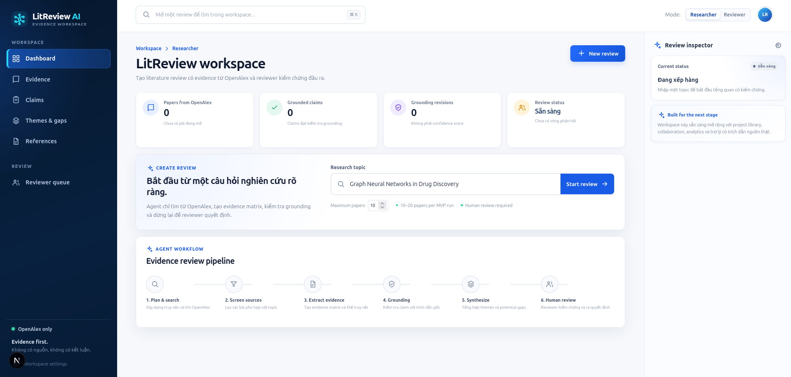
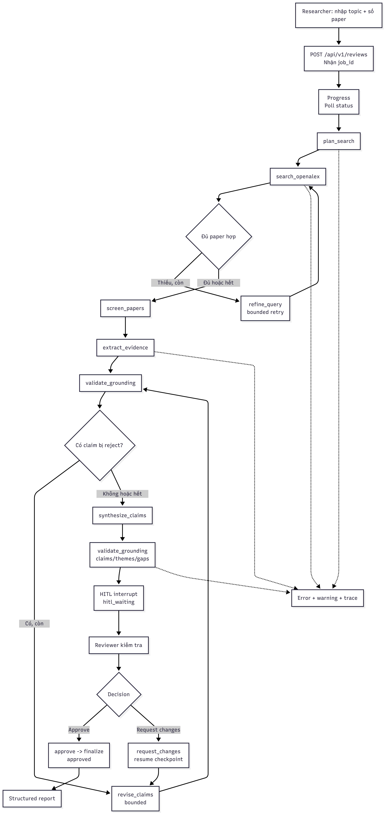

# Wireframe / UI Flow — MVP 1

> Historical Gate 1 wireframe. UI hiện tại dùng project-scoped routes và nhiều
> màn hình hơn; xem [Wireframe_UI_Flow.md](Wireframe_UI_Flow.md) cho screen map
> đang duy trì.

Tài liệu này chốt **luồng màn hình và luồng xử lý chính**. `UI.png` là hình tham
chiếu visual; `mvp1_flow.png` là sơ đồ E2E của MVP1.

## 1. Visual wireframe

## 2. E2E workflow

## 3. Các màn hình chính

| Màn hình | Nội dung chính | API chính |
|---|---|---|
| Create review | Topic, số paper, nút Start review | `POST /api/v1/reviews` |
| Progress | Stepper pipeline, phase, paper/claim count, lỗi | `GET /api/v1/reviews/{id}/status` |
| Report | Evidence, Claims, Themes & gaps, References, scope disclaimer | `GET /api/v1/reviews/{id}` |
| Reviewer | Claim + quote + abstract + metadata; supported/unsupported | `GET /api/v1/reviews?…` |
| Decision | Approve hoặc Request changes; trạng thái resume | `POST /api/v1/reviews/{id}/review` |

## 4. Bố cục gợi ý

- **Sidebar:** Dashboard, Evidence, Claims, Themes & gaps, References, Reviewer queue.
- **Main:** create card hoặc report tabs.
- **Right inspector:** trạng thái job, reviewer decision và cảnh báo provenance.
- **Responsive:** desktop split view; mobile xếp claim trước evidence.

## 5. Giới hạn MVP 1

Chỉ hiển thị OpenAlex metadata/abstract, evidence và structured report. Chatbot,
full-text/PDF reader, Qdrant, data-analysis, sandbox và export Word/PDF để ở
roadmap, không vẽ như chức năng đã chạy.
