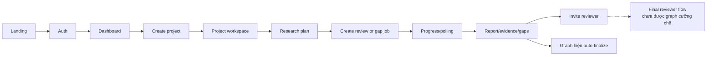

# Wireframe & UI Flow

> Screen map theo `frontend/app/` và API hiện tại, cập nhật 2026-09-01.

## 1. Route map

```text
/
├── /auth
├── /dashboard
├── /projects/new
├── /projects/[id]
│   ├── /loading
│   ├── /members
│   ├── /synthesis
│   ├── /reports/[reportId]
│   ├── /document-review
│   └── /sandbox
├── /workspace
└── /legacy
```

`/preview-desk/*` là preview route, không phải primary production navigation.

## 2. End-to-end project flow



## 3. Screen requirements

### Landing và auth

- Giải thích product value, provenance và human review.
- Clerk sign-in/sign-up; production session không dùng role switch giả lập.
- VI/EN toggle phải nhất quán với phần còn lại của app.

### Dashboard

- Liệt kê project actor được phép truy cập.
- Hiển thị trạng thái review/report gần nhất và đường dẫn tạo project.
- Empty/loading/error state riêng; không giả lập project khi API lỗi.

### Create project

- Thu thập title, topic/scope và field thực sự có trong API schema.
- Validate phía client để hỗ trợ UX, nhưng backend vẫn là nguồn validation.
- Sau tạo thành công điều hướng về `/projects/{id}`.

### Project workspace

- Hiển thị members, plan, review jobs, report versions, conversations và action state theo capability.
- Cho phép tạo literature review hoặc research-gap job.
- Phân biệt queued/running/HITL/completed/failed/cancelled bằng text và status, không chỉ màu.

### Loading/progress

- Poll endpoint project review; dừng polling ở terminal state.
- Hiển thị phase/progress/warning có từ API, không tự suy đoán LangGraph node.
- Có retry navigation/cancel khi API cho phép.

### Report reader/synthesis

- Hiển thị paper/source, evidence quote/locator, claim verdict, theme và gap candidate.
- Link citation phải đến metadata/provider URL đã lưu.
- Gap phải có confidence, support/counter-evidence và reviewer status; không gọi candidate là sự thật toàn ngành.

### Members và reviewer

- Owner/researcher tạo/revoke/resend invitation và copy link khi email không cấu hình.
- Reviewer chỉ thấy assignment được giao.
- Invitation/assignment và decision API đã tồn tại. Tuy nhiên graph hiện
  auto-finalize sau paper selection, nên không mô tả final decision UI như một
  bước bắt buộc có thể đạt tới trong flow hiện tại.

### Document review

- Nhập/upload tài liệu theo constraint backend.
- Hiển thị suggestion/citation issue, explain, rewrite và apply state.
- Không apply mutation âm thầm; user phải thấy nội dung thay đổi.

### Sandbox

- Hiển thị capability/preflight trước khi mở session.
- Có trạng thái execution, artifact và adoption; không expose internal control endpoint.
- Error/timeout không được làm mất project context.

## 4. Accessibility và responsive baseline

- Semantic heading, label, button và landmark.
- Focus visible, keyboard flow và thông báo lỗi gắn đúng field.
- Status không truyền đạt chỉ bằng màu.
- Desktop/mobile giữ được citation, table và reviewer action quan trọng.
- Nội dung VI/EN không trộn trong cùng một UI state nếu có bản dịch.

## 5. API boundary

Frontend gọi API dưới `/api/v1` và lấy identity token từ Clerk. Danh sách route chính xác xem OpenAPI `/docs`; UI không hardcode port khác `NEXT_PUBLIC_API_BASE_URL`.
