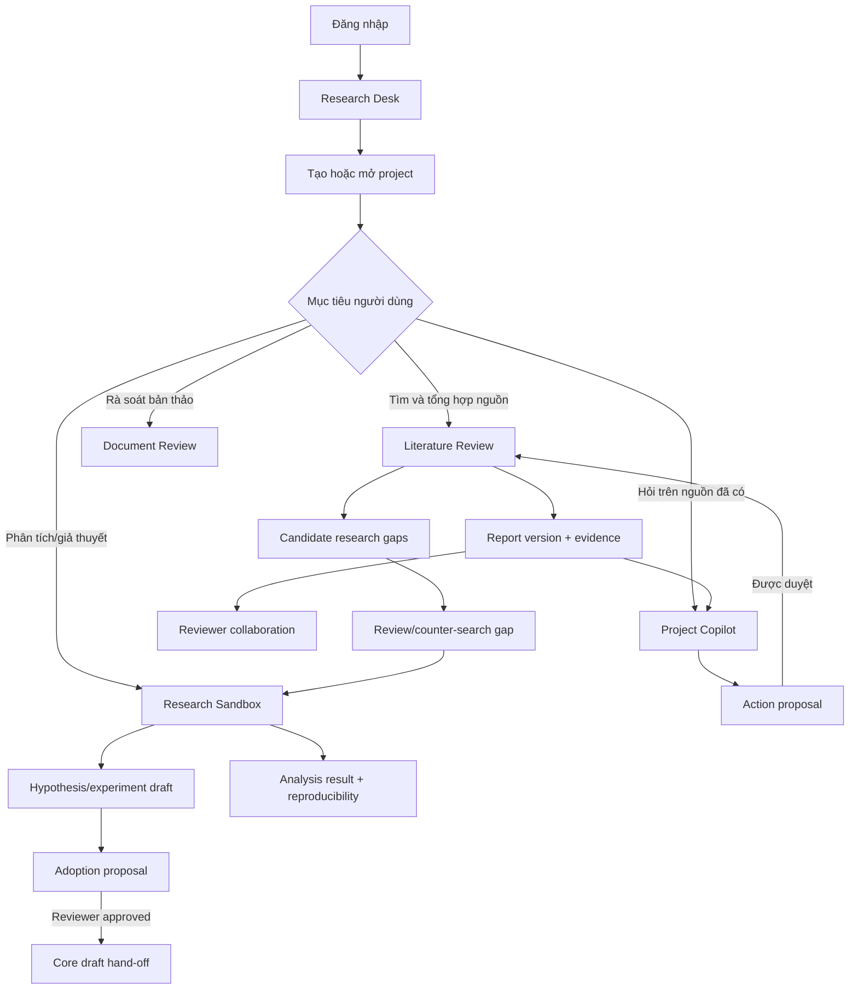
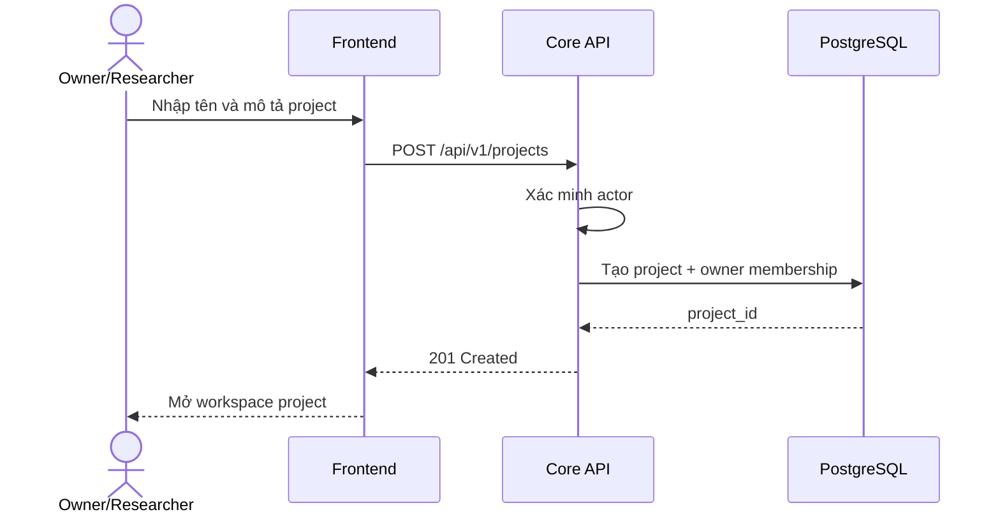
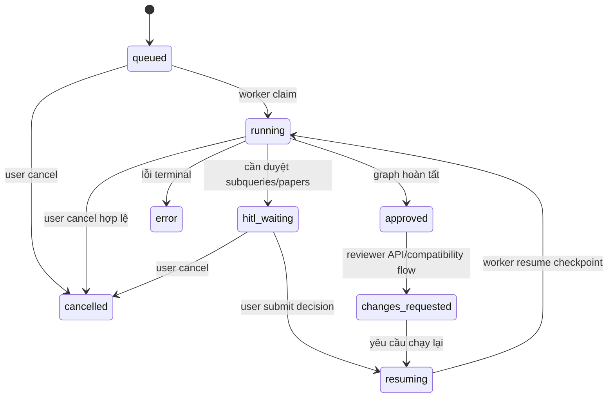
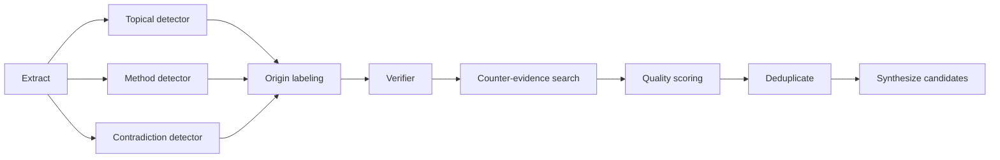
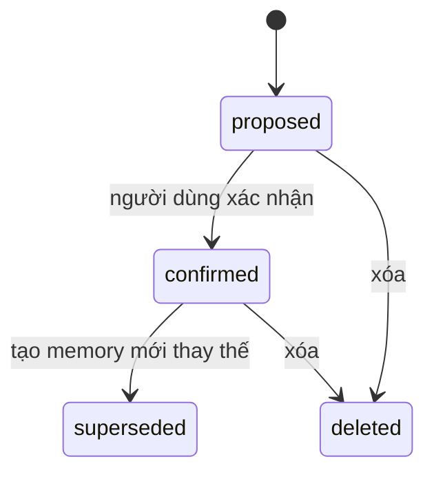
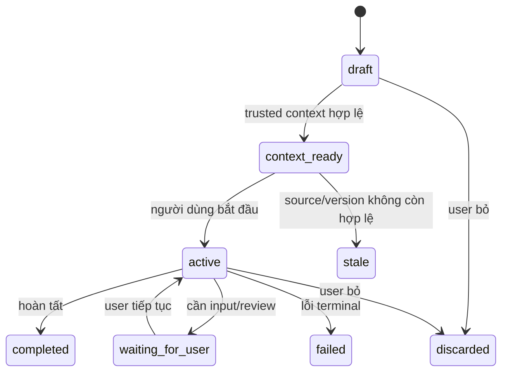
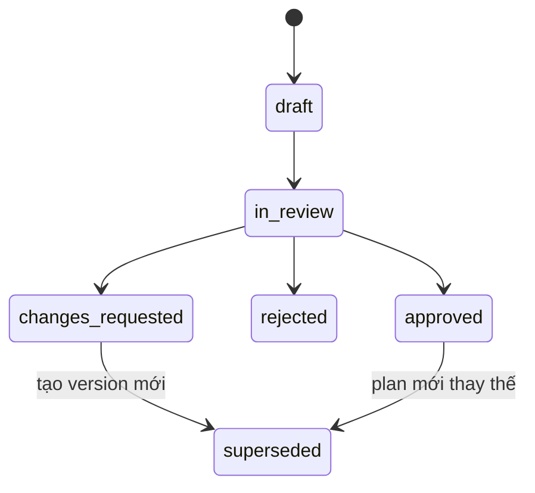
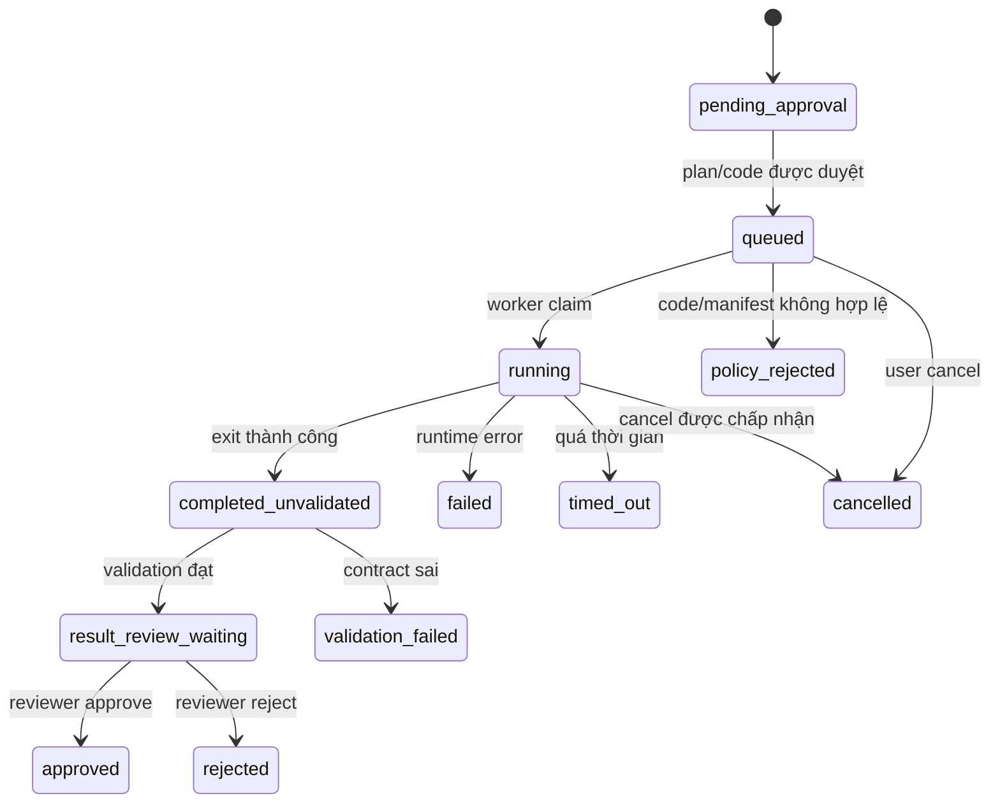
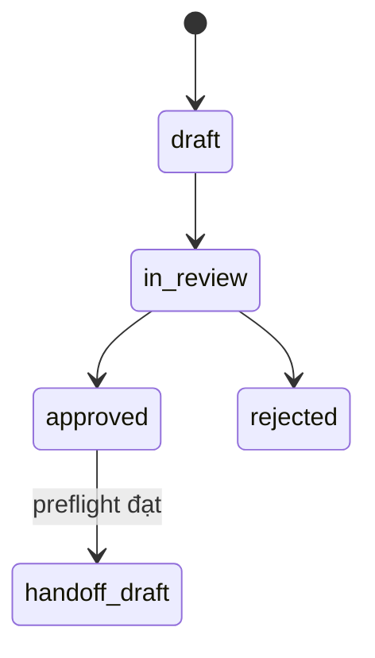

# Luồng nghiệp vụ chi tiết dự án LitReview (P-178)

> Tài liệu mô tả hành trình nghiệp vụ và trạng thái **đang được triển khai trong mã nguồn** tại nhánh `main`, commit `4fad4bb`. Tài liệu nên được đọc cùng [Thông số kỹ thuật](THONG_SO_KY_THUAT.md). Khi PRD/roadmap khác với code, migration và test, trạng thái trong code được ưu tiên.

## 1. Mục tiêu nghiệp vụ

LitReview hỗ trợ nhóm nghiên cứu đi từ một câu hỏi ban đầu đến các artifact có thể kiểm tra và tái sử dụng:

1. Tạo không gian project và xác lập quyền truy cập.
2. Lập kế hoạch tìm kiếm tài liệu.
3. Tìm, lọc và chọn corpus học thuật.
4. Trích bằng chứng, hình thành claim và kiểm tra grounding.
5. Tạo báo cáo cùng citation/provenance.
6. Phát hiện và thẩm định research gap.
7. Cộng tác với reviewer và quản lý phiên bản báo cáo.
8. Hỏi đáp tiếp theo trong Copilot dựa trên nguồn của project.
9. Rà soát bản thảo PDF.
10. Chuyển một câu hỏi/gap thành giả thuyết hoặc phân tích dữ liệu trong Sandbox.
11. Chỉ đưa kết quả Sandbox trở lại core dưới dạng proposal đã qua kiểm soát.

Nguyên tắc xuyên suốt là **evidence first, human-governed, project-scoped**: AI hỗ trợ xử lý và đề xuất, nhưng không được tự tạo nguồn, tự cấp quyền hoặc âm thầm thay đổi artifact đã được duyệt.

## 2. Vai trò và phạm vi quyền

| Vai trò | Trách nhiệm nghiệp vụ | Quyền chính |
|---|---|---|
| Owner | Sở hữu project và chịu trách nhiệm phạm vi nghiên cứu | Tạo/xóa project, quản lý thành viên, chạy review/gap, mời reviewer, sử dụng Copilot, Document Review và Sandbox |
| Researcher | Thực hiện công việc nghiên cứu trong project | Lập plan, tạo job, duyệt sub-query/paper, làm việc với report, memory, action và Sandbox theo capability |
| Reviewer | Kiểm tra artifact được giao | Xem assignment/report/evidence, đưa decision, review plan/result/adoption theo phạm vi được cấp |
| AI Agent | Đề xuất và xử lý có giới hạn | Phân loại intent, tìm kiếm, tổng hợp, kiểm chứng, sinh draft; không tự cấp quyền hoặc xác nhận thay con người ở contract cần reviewer |
| Background Worker | Thực thi job bền vững | Claim job, chạy graph, ghi checkpoint/progress/result; không quyết định quyền truy cập |
| Sandbox Worker | Thực thi analysis run cô lập | Xác minh manifest, chạy code đã qua policy, thu artifact và cập nhật trạng thái |

Ranh giới phân quyền:

- Actor được suy ra từ Clerk/session đã xác thực, không lấy từ `user_id` hoặc `role` tùy ý trong client payload.
- Mọi dữ liệu nghiệp vụ quan trọng đều gắn `project_id`.
- Reviewer chỉ được truy cập review/assignment đã được giao.
- Browser không gửi trực tiếp trusted context, actor identity hoặc HMAC header sang Sandbox.

## 3. Bức tranh nghiệp vụ tổng thể



## 4. Luồng 0 — Đăng nhập và tạo phiên

### 4.1 Tiền điều kiện

- Frontend đã được cấu hình Clerk cho môi trường production.
- Người dùng có tài khoản hợp lệ.
- Development/test có thể dùng bootstrap session xác định để test cô lập.

### 4.2 Luồng chính

1. Người dùng mở trang Landing hoặc Research Desk.
2. Nếu chưa có session, người dùng đăng nhập qua Clerk.
3. Frontend nhận session/token và gửi request qua BFF/API.
4. Backend xác minh issuer, JWKS, authorized party và ánh xạ identity thành actor nội bộ.
5. Backend trả hồ sơ `/me` và danh sách project mà actor được phép xem.
6. Người dùng được chuyển vào Research Desk.

### 4.3 Ngoại lệ

| Tình huống | Xử lý nghiệp vụ |
|---|---|
| Token thiếu/hết hạn/không hợp lệ | Trả 401; yêu cầu đăng nhập lại |
| Token hợp lệ nhưng không có quyền project | Trả 403/404 theo policy, không làm lộ sự tồn tại dữ liệu |
| Clerk chưa cấu hình ở local | UI có thể hiển thị trạng thái chưa cấu hình hoặc dùng flow test được cho phép |
| Identity field do client tự khai | Backend bỏ qua/reject; dùng trusted auth context |

## 5. Luồng 1 — Quản lý Project Workspace

### 5.1 Tạo project



Điều kiện dữ liệu:

- ID được server sinh, không lấy từ AI.
- Người tạo trở thành owner/membership tương ứng.
- Conversation, report, memory, gap, member và Sandbox session sau đó đều nằm trong ranh giới project.

### 5.2 Làm việc trong project

Người dùng có thể:

- Xem capability snapshot theo vai trò và trạng thái dữ liệu.
- Quản lý thành viên.
- Tạo research plan.
- Tạo Literature Review hoặc Research Gap job.
- Xem report versions.
- Mở conversation/Copilot.
- Mời reviewer.
- Mở Document Review hoặc Sandbox nếu capability cho phép.

### 5.3 Xóa project

1. Owner yêu cầu xóa project.
2. Backend xác minh quyền owner.
3. Hệ thống xóa/cascade các bản ghi theo migration và service policy.
4. Artifact dẫn xuất như index Qdrant phải được dọn hoặc trở nên không còn truy cập được.

Đây là thao tác phá hủy; UI nên yêu cầu xác nhận rõ ràng. Không cho actor ngoài project thực hiện.

## 6. Luồng 2 — Lập và duyệt Research Plan

1. Researcher mô tả mục tiêu nghiên cứu, phạm vi, câu hỏi hoặc tiêu chí.
2. Frontend gửi `POST /projects/{project_id}/research-plans`.
3. Backend kiểm tra membership và tạo plan draft.
4. Người có quyền xem lại nội dung plan.
5. Khi đồng ý, gửi request `approve`.
6. Plan được dùng làm đầu vào có cấu trúc cho review/gap phù hợp.

Nếu plan không phù hợp, người dùng chỉnh nội dung hoặc tạo phiên bản mới thay vì sửa âm thầm lịch sử đã duyệt.

## 7. Luồng 3 — Literature Review có người dùng duyệt

Đây là luồng nghiệp vụ trung tâm và là chế độ mặc định `execution_mode=review`.

### 7.1 Khởi tạo job

1. Researcher chọn **Tìm tài liệu**.
2. Nhập câu hỏi/chủ đề, ngôn ngữ đầu ra và số kết quả mong muốn.
3. Chọn chế độ **Người dùng duyệt**.
4. Frontend gửi `POST /api/v1/projects/{project_id}/reviews`.
5. Backend kiểm tra membership, giới hạn job đồng thời và payload.
6. PostgreSQL tạo durable job ở trạng thái `queued`.
7. API gửi notification best-effort lên Redis Streams.
8. API trả `202 Accepted` cùng `job_id`.

### 7.2 Worker nhận việc

1. Worker nhận event Redis hoặc phát hiện job qua PostgreSQL polling.
2. Worker claim job bằng row lock, lease và execution fence.
3. Job chuyển `queued → running`.
4. LangGraph được chạy với checkpoint PostgreSQL.
5. Frontend poll status/progress; Redis có thể cache status trong thời gian ngắn.

Nếu Redis không hoạt động, job vẫn tiếp tục qua PostgreSQL. Nếu worker chết, lease hết hạn cho phép worker khác reclaim.

### 7.3 Kiểm tra intent

1. Agent phân loại yêu cầu.
2. Nếu đúng phạm vi literature review, chuyển sang lập kế hoạch tìm kiếm.
3. Nếu ngoài phạm vi, chuyển `out_of_scope → END`, trả lý do thay vì tạo báo cáo giả.

### 7.4 Lập và duyệt sub-query

1. Agent sinh danh sách sub-query và search terms.
2. Job dừng ở `hitl_waiting`, stage `subqueries`.
3. UI hiển thị các truy vấn đề xuất.
4. Researcher có thể thêm, sửa hoặc xóa truy vấn.
5. Mỗi sub-query thủ công phải có 8–14 từ; tối đa 12 sub-query trong resume payload.
6. Người dùng xác nhận; frontend gọi `POST /reviews/{job_id}/resume` với stage `subqueries`.
7. Job chuyển `resuming → running` và tiếp tục từ checkpoint.

Nếu người dùng không duyệt, job giữ trạng thái chờ; không tự tìm kiếm thay người dùng trong chế độ review.

### 7.5 Tìm kiếm nguồn

1. Worker tìm song song qua OpenAlex, Semantic Scholar và arXiv.
2. Kết quả được normalize và deduplicate.
3. Metadata/DOI/URL lấy từ provider, không lấy từ LLM.
4. Agent đánh giá số lượng và chất lượng corpus.
5. Nếu thiếu nguồn và còn lượt, agent refine query rồi tìm lại.
6. Nếu không có paper sau giới hạn retry, job đi tới `error` với lý do.
7. Nếu đủ nguồn, chuyển sang screening.

### 7.6 Screening và chọn paper

1. Agent lọc/rank paper theo mức liên quan.
2. Job dừng ở `hitl_waiting`, stage `papers`.
3. UI hiển thị title, authors, year, provider, URL, citation count và relevance.
4. Researcher chọn thủ công hoặc dùng danh sách xếp hạng.
5. Resume payload cho phép tối đa 50 `selected_paper_ids`.
6. Backend xác minh paper ID thuộc tập kết quả của chính job.
7. Job chuyển `resuming → running`.

Nếu không có paper phù hợp sau screening, workflow kết thúc lỗi có giải thích; không compose báo cáo rỗng gây hiểu lầm.

### 7.7 Ingestion và index

1. Hệ thống cố lấy full text hợp lệ từ PDF, PMC XML hoặc HTML.
2. Nếu full text không khả dụng, dùng abstract fallback và gắn đúng `source_level`.
3. Nội dung được chia chunk và index vào Qdrant theo corpus/job.
4. Mỗi paper ghi trạng thái ingestion: `succeeded`, `unavailable` hoặc `failed`.
5. Qdrant/Gemini embedding lỗi có thể chuyển sang FastEmbed collection fallback.
6. Lỗi index không được làm mất job/report trong PostgreSQL.

### 7.8 Trích evidence, sinh và kiểm tra claim

1. Agent trích quote từ full text hoặc abstract đã chuẩn bị.
2. Mỗi evidence giữ paper ID, section, source level, locator/hash khi có.
3. Agent sinh claim từ evidence, không sinh evidence từ claim.
4. Grounding validator kiểm tra entailment giữa claim và quote.
5. Claim hợp lệ được giữ; claim bị loại được sửa/tách tối đa theo vòng lặp bounded.
6. Nếu vẫn không có claim hợp lệ nhưng còn corpus, báo cáo phải nêu giới hạn evidence.
7. Nếu graph gặp lỗi terminal, job chuyển `error`.

### 7.9 Phân tích gap và compose báo cáo

1. Agent phân nhóm theme và potential gaps từ corpus đã kiểm chứng.
2. Gap chỉ được diễn giải trong phạm vi corpus, không khẳng định toàn bộ lĩnh vực chưa từng nghiên cứu.
3. Agent tạo literature review với citation marker `[n]`.
4. Report, references, claims, evidence, warnings và provenance được lưu.
5. Project service snapshot kết quả thành report version.

### 7.10 Kết thúc hiện tại

Trong implementation hiện tại, `human_review_node` cuối tự đặt `approve` cho cả chế độ `review` và `autonomous`, sau đó đi tới `finalize`. Vì vậy:

- Duyệt sub-query và paper selection là HITL thật.
- Final reviewer API/schema có tồn tại.
- Final reviewer chưa phải gate cưỡng chế trong graph đang chạy.
- UI/tài liệu không được tuyên bố báo cáo bắt buộc chờ reviewer cuối nếu code chưa được sửa.

## 8. Vòng đời Literature Review Job



| Trạng thái | Ý nghĩa nghiệp vụ | Hành động phù hợp |
|---|---|---|
| `queued` | Đã nhận yêu cầu, chưa có worker xử lý | Chờ hoặc hủy |
| `running` | Agent đang thực thi | Theo dõi progress; không tạo yêu cầu trùng |
| `hitl_waiting` | Đang chờ quyết định người dùng | Duyệt sub-query/paper hoặc hủy |
| `resuming` | Quyết định đã lưu, chờ worker tiếp tục | Chờ |
| `approved` | Graph hoàn tất và result khả dụng | Đọc, đánh giá, tạo artifact tiếp theo |
| `changes_requested` | Reviewer yêu cầu điều chỉnh qua compatibility flow | Resume theo decision |
| `cancelled` | Job bị hủy | Tạo job mới nếu cần |
| `error` | Job thất bại có lý do | Xem stage/warning/error, sửa input/config rồi chạy lại |

## 9. Luồng 4 — Literature Review tự động

Với `execution_mode=autonomous`:

1. Tạo job giống luồng review.
2. Agent tự dùng sub-query đã sinh.
3. Agent tự dùng tập paper được rank thay vì dừng HITL.
4. Các bước search, ingestion, evidence, grounding, gap và compose giữ nguyên invariant.
5. Job hoàn tất thành report.

Chế độ tự động chỉ bỏ hai điểm dừng tương tác; nó không được bỏ qua grounding, source provenance, giới hạn retry hoặc project authorization.

## 10. Luồng 5 — Đọc báo cáo và làm việc với nguồn

1. Người dùng mở report version trong project.
2. UI hiển thị short answer/tổng quan, themes, claims, evidence và references.
3. Người dùng chọn một claim để xem quote và nguồn hỗ trợ.
4. Có thể mở URL provider để kiểm tra nguồn gốc.
5. Có thể query riêng tập selected papers qua RAG endpoint.
6. Khi Qdrant lỗi, UI cần phân biệt retrieval không khả dụng với report bị mất.
7. Người dùng có thể gửi evaluation cho report đã hoàn thành và được duyệt theo điều kiện API.

Quy tắc đọc kết quả:

- Claim factual không có citation/provenance phải được xem là `insufficient_evidence`.
- Evidence từ abstract phải được phân biệt với full text.
- Mối liên hệ quan sát không được tự nâng thành quan hệ nhân quả.
- Warning về provider, ingestion hoặc fallback phải được hiển thị, không che giấu.

## 11. Luồng 6 — Reviewer Collaboration

### 11.1 Mời reviewer

1. Owner/researcher chọn một review cụ thể.
2. Nhập reviewer/email và tạo invitation.
3. Backend sinh token, expiry và assignment scope.
4. Nếu Resend đã cấu hình, hệ thống gửi email.
5. Nếu email chưa cấu hình/gửi lỗi, invitation vẫn cung cấp copyable link.
6. Owner có thể resend hoặc revoke invitation.

### 11.2 Reviewer nhận lời

1. Reviewer mở link invitation.
2. Hệ thống yêu cầu đăng nhập nếu cần.
3. Backend kiểm tra token, trạng thái và thời hạn.
4. Reviewer accept hoặc decline.
5. Khi accept, assignment/membership cần thiết được tạo theo scope.

### 11.3 Reviewer đánh giá report

1. Reviewer mở danh sách assignments.
2. Chỉ report/evidence được giao mới khả dụng.
3. Reviewer đọc version bất biến và provenance.
4. Reviewer submit decision: approve, request changes hoặc reject theo endpoint hiện có.
5. Decision lưu reviewer actor, thời gian và loại self/external review.
6. Nếu yêu cầu chỉnh sửa, revision phải tạo version mới; không sửa lịch sử âm thầm.

Ngoại lệ: invitation hết hạn, bị revoke, đã dùng hoặc không đúng actor phải bị từ chối.

## 12. Luồng 7 — Research Gap Detection và Review

### 12.1 Tạo gap job

1. Researcher chọn project/corpus phù hợp.
2. Tạo `POST /projects/{project_id}/research-gaps`.
3. Backend tạo durable job và worker xử lý ở chế độ autonomous.
4. Hệ thống shape query và tìm corpus bổ sung khi cần.

### 12.2 Pipeline gap



Mỗi candidate nên có:

- Loại gap và phát biểu trong phạm vi.
- Evidence supporting refs.
- Counter-evidence hoặc kết quả counter-search.
- Confidence/quality score và coverage.
- Verification status.
- Hạn chế và lý do cần nghiên cứu tiếp.

### 12.3 Reviewer verdict

Reviewer có thể:

- Approve candidate.
- Narrow phạm vi candidate.
- Reject candidate.
- Yêu cầu counter-search/bổ sung bằng chứng.

UI phải phân biệt rõ candidate do AI phát hiện với gap đã được reviewer xác nhận. Gap đã approve có thể trở thành đầu vào cho Hypothesis Sandbox.

## 13. Luồng 8 — Project Copilot

### 13.1 Hội thoại grounded

1. Người dùng tạo conversation trong project.
2. Gửi câu hỏi follow-up.
3. Backend kiểm tra actor và xác định corpus/report version được phép dùng.
4. Copilot truy xuất evidence trong project.
5. Câu trả lời factual phải có citation hoặc trả thiếu bằng chứng.
6. Message và citation được lưu theo conversation.
7. Client có thể đọc event/progress khi xử lý bất đồng bộ.

Copilot không được dùng memory hội thoại để thay thế paper/evidence/report artifact.

### 13.2 Memory lifecycle



Memory dùng để giữ context làm việc, preference hoặc fact đã được quản trị. Memory không tự cấp quyền và không được truy xuất ngoài project.

### 13.3 Governed action proposal

1. Copilot/người dùng đề xuất một mutation hoặc tác vụ tốn chi phí, ví dụ `search_more`.
2. Backend tạo action ở trạng thái `proposed`; chưa thực thi ngay.
3. UI hiển thị loại action, tham số, ảnh hưởng và report version gốc.
4. Người có quyền approve hoặc reject/cancel.
5. Khi approve, action chuyển qua queued/running.
6. Worker/service thực thi và tạo result/report version mới.
7. Action kết thúc `completed` hoặc `failed`.

Guardrails:

- `Idempotency-Key` lặp lại phải trả cùng action/job thay vì chạy hai lần.
- Nếu base report version đã thay đổi, action phải bị đánh dấu stale/`ACTION_STALE`.
- AI không được tự approve action do chính nó đề xuất.

## 14. Luồng 9 — Document Review

### 14.1 Tạo review tài liệu

1. Researcher mở Document Review trong project.
2. Upload PDF hoặc cung cấp tài liệu theo endpoint được hỗ trợ.
3. Backend kiểm tra membership, loại file, kích thước tối đa và số trang.
4. Parser dùng LlamaParse khi có cấu hình; nếu không, fallback pypdf.
5. Hệ thống lưu source bundle tạm thời theo retention policy.
6. Critic phân tích section, citation và đề xuất annotation.

### 14.2 Làm việc với annotation

Mỗi annotation bắt đầu ở `pending` và người dùng có thể:

- `accept` → `accepted`.
- `reject` → `rejected`.
- `dismiss` → `dismissed`.

Người dùng cũng có thể:

- Chọn đoạn văn và yêu cầu giải thích.
- Yêu cầu rewrite với mục tiêu cụ thể.
- Verify claim/citation.
- Reanalyze sau khi nội dung thay đổi.
- Apply suggestion đã chọn.

### 14.3 Kiểm soát thay đổi

1. Nội dung gốc không bị thay đổi chỉ vì AI tạo suggestion.
2. Apply cần hành động rõ ràng của người dùng.
3. Mỗi annotation giữ trạng thái và provenance.
4. Link/citation lỗi phải được báo riêng, không suy diễn rằng toàn bộ document sai.
5. PDF/input được xem là untrusted content; prompt injection trong tài liệu không được thay đổi system policy.

## 15. Luồng 10 — Mở Research Sandbox

### 15.1 Kiểm tra capability

1. Frontend gọi `/projects/{project_id}/sandbox/capabilities`.
2. Core backend kiểm tra actor/membership.
3. Nếu `SANDBOX_ENABLED=false`, trả capability bị giới hạn; không gọi outbound sang Sandbox.
4. Nếu bật, từng capability con tiếp tục được kiểm tra.

### 15.2 Tạo session

Sandbox hỗ trợ ba mode:

| Mode | Mục tiêu |
|---|---|
| `hypothesis` | Phát triển giả thuyết và experiment draft |
| `graph_overlay` | Thử quan hệ/nút giả định mà không sửa graph gốc |
| `data_analysis` | Profile dataset, lập plan, chạy và review kết quả |

Entrypoint:

- `manual`: không có `source_resource_id`.
- `graphrag_answer`: mở từ câu trả lời GraphRAG đã ghim.
- `validated_candidate`: mở từ candidate/gap đã kiểm chứng.
- `experiment_proposal`: mở từ đề xuất thí nghiệm.

Với entrypoint không phải manual, `source_resource_id` là bắt buộc. Core lấy trusted context theo project, pin graph/resource version, ký snapshot rồi mới chuyển cho Sandbox.

### 15.3 Vòng đời session



Mọi chuyển trạng thái đều có history gồm actor, trạng thái trước/sau, lý do và thời gian.

## 16. Luồng 11 — Hypothesis Sandbox

1. Người dùng mở session từ validated candidate/GraphRAG answer hoặc tạo thủ công.
2. Sandbox nhận context snapshot có question, evidence refs, limitations và version/hash.
3. AI sinh hypothesis draft có statement, rationale, evidence, assumptions, falsification criteria, required data và limitations.
4. Draft ở trạng thái `draft`; evidence có thể `verified`, `unverified` hoặc `insufficient_evidence`.
5. Người dùng/reviewer xem và quyết định `reviewed` hoặc `rejected`.
6. Từ hypothesis, AI có thể sinh experiment draft gồm biến, control, method, metric, assumption, stopping criteria và risk.
7. Nếu chỉnh sửa, tạo version/draft mới và supersede bản cũ.

Vòng đời draft: `draft → reviewed | rejected | superseded`.

Hypothesis phải được diễn giải là giả thuyết có thể bác bỏ, không phải factual conclusion mới.

## 17. Luồng 12 — Graph Overlay Sandbox

1. Người dùng mở session từ candidate đã kiểm chứng.
2. Sandbox đọc snapshot của graph version gốc.
3. Người dùng tạo overlay gắn đúng `base_graph_version_id`.
4. Thêm operation giả định như add/remove node/edge, kèm rationale và evidence refs.
5. Mọi operation được đánh dấu hypothetical.
6. Hệ thống tạo comparison giữa base graph và overlay.
7. Agent/service assess ảnh hưởng của overlay.
8. Graph gốc giữ nguyên; không có write path trực tiếp từ overlay.
9. Nếu muốn đưa kết quả về core, tạo adoption proposal.

Nếu base graph version thay đổi, overlay có thể trở thành stale và cần tạo lại/rebase theo policy.

## 18. Luồng 13 — Data Analysis Sandbox

### 18.1 Upload và profile dataset

1. Researcher tạo session `data_analysis`.
2. Upload CSV/XLSX/Parquet hợp lệ và khai báo classification.
3. Backend kiểm tra định dạng, kích thước, project scope và content hash.
4. Raw bytes được lưu trong object storage, không lưu trong prompt/audit state.
5. Profiling tạo metadata như cột, kiểu dữ liệu, missingness và số dòng.
6. AI chỉ nhận schema/profile cần thiết, không nhận raw rows.

### 18.2 Làm rõ câu hỏi phân tích

Người dùng cung cấp:

- Objective: `describe`, `compare`, `associate` hoặc `predict`.
- Research question.
- Outcome, predictor, group và covariate columns.
- Study design/repeated measures nếu có.
- Hypothesis, preferred metrics và ngôn ngữ đầu ra.

Nếu thiếu trường quyết định, hệ thống trả `question_incomplete` và câu hỏi làm rõ; AI không tự đoán cột hoặc mục tiêu.

### 18.3 Tạo và duyệt AnalysisPlan

1. AI tạo plan draft từ question + dataset profile + context đã pin.
2. Plan nêu method, rationale, preprocessing, assumption checks, metrics và limitations.
3. Reviewer chuyển plan qua `in_review`.
4. Reviewer chọn `approved`, `rejected` hoặc `changes_requested`.
5. Nếu sửa, tạo version mới; version cũ chuyển `superseded` khi phù hợp.
6. Chỉ plan version `approved` mới được queue run.



### 18.4 Sinh và kiểm tra code

1. AI sinh Python source code theo plan đã duyệt.
2. Server gắn lineage: plan/version/hash và prompt version.
3. AST code policy kiểm tra import, filesystem, network và hành vi bị cấm.
4. Code hợp lệ chuyển `approved`; code vi phạm chuyển `policy_rejected`.
5. Revision code bị giới hạn; version cũ có thể `superseded`.

### 18.5 Queue và chạy analysis

1. Người dùng xác nhận chạy với `random_seed` (mặc định 42).
2. Backend dùng idempotency key để ngăn chạy trùng.
3. Hệ thống tạo immutable signed execution manifest gồm dataset hash, plan hash, code hash, image digest, package hash, seed và resource limits.
4. Run chuyển `queued`.
5. Sandbox worker claim run bằng lease.
6. Worker xác minh chữ ký, nonce, expiry và các hash.
7. Runtime container chạy non-root, read-only, không network và có quota.
8. SDK ghi result/chart/table/diagnostic theo output contract.
9. Worker thu artifact, kiểm tra hash/quota rồi xóa workspace tạm.

### 18.6 Validate, diễn giải và review kết quả

1. Run thành công chuyển `completed_unvalidated`.
2. Result validator kiểm tra schema, row counts, metric, artifact refs và consistency.
3. Nếu sai, chuyển `validation_failed`.
4. Nếu hợp lệ, hệ thống có thể sinh narrative/numeric claims với locator vào result JSON.
5. Run chuyển `result_review_waiting`.
6. Reviewer đọc method, diagnostics, metrics, warnings, limitations, code và artifact.
7. Reviewer chọn `approved` hoặc `rejected`.
8. Sau approval, người dùng tải reproducibility bundle.



### 18.7 Reproducibility bundle

Bundle phải liên kết tối thiểu:

- Dataset content hash.
- Research question và AnalysisPlan version/hash.
- Code version/hash.
- Runtime image digest và package manifest hash.
- Random seed và resource limits.
- Result/artifact hashes.
- Validation và reviewer decision.

Bundle hỗ trợ tái lập và audit; không biến một association thành causal claim.

## 19. Luồng 14 — Adoption từ Sandbox về Core

Sandbox không xuất bản trực tiếp vào core graph.

1. Người dùng chọn một hypothesis đã review hoặc overlay assessment.
2. Tạo adoption proposal với `source_type`, `source_id` và rationale.
3. Proposal bắt đầu `draft`.
4. Reviewer chuyển `in_review`.
5. Reviewer `approved` hoặc `rejected`.
6. Chỉ proposal approved mới được hand-off.
7. Core chạy adoption preflight để kiểm tra project, source, version/hash và idempotency.
8. Core tạo **draft** mới, không âm thầm publish/ghi đè artifact gốc.
9. Audit event ghi requester, reviewer và nguồn.



Nếu preflight thất bại hoặc source đã stale, không tạo core draft; người dùng phải cập nhật proposal/context.

## 20. Luồng 15 — Xuất và tái sử dụng artifact

Từ report/result đã lưu, người dùng có thể sử dụng các artifact trình bày hoặc trao đổi:

- Report reader với citation/evidence matrix.
- LaTeX/source bundle và PDF khi luồng export khả dụng.
- Mind map hoặc visual artifact từ báo cáo.
- Slide deck/speaker notes từ nội dung report.
- Reproducibility bundle của Sandbox run.

Quy tắc nghiệp vụ:

- Artifact trình bày phải tham chiếu report/version nguồn.
- Không được tạo claim mới không có trong evidence chỉ để làm slide hấp dẫn hơn.
- Khi report version đổi, artifact cũ vẫn giữ lineage tới version đã dùng.
- Export lỗi không làm thay đổi report source of truth.

## 21. Ma trận điểm phê duyệt

| Điểm quyết định | Người quyết định | Bắt buộc trong code hiện tại | Kết quả |
|---|---|---:|---|
| Duyệt sub-query | Researcher | Có trong review mode | Resume search |
| Chọn paper | Researcher | Có trong review mode | Chốt corpus |
| Final graph review | Reviewer | **Chưa cưỡng chế** | Node hiện tự approve |
| Report reviewer submission | Reviewer được giao | Có API/schema | Decision + version workflow |
| Confirm memory | Project member có quyền | Có | Memory usable |
| Approve action proposal | Actor có quyền | Có | Cho phép mutation/job chạy |
| Gap verdict | Reviewer | Có API/schema | Approve/narrow/reject |
| Annotation apply | Researcher | Có | Thay đổi nội dung có chủ đích |
| Hypothesis review | Reviewer/user theo policy | Có | Reviewed/rejected draft |
| AnalysisPlan approval | Reviewer | Có | Mở quyền queue analysis run |
| Analysis result approval | Reviewer | Có | Run approved/rejected |
| Adoption approval | Reviewer | Có | Cho phép hand-off thành core draft |

## 22. Quy tắc idempotency, versioning và concurrency

### 22.1 Idempotency

- Mutation quan trọng và Sandbox execution dùng idempotency key.
- Gửi lại cùng key và cùng payload trả resource cũ.
- Cùng key nhưng payload khác phải conflict.
- Worker fence ngăn kết quả từ lease cũ ghi đè execution mới.

### 22.2 Versioning

- Report, plan, code, hypothesis/experiment và artifact thay đổi tạo version mới.
- Version cũ giữ nguyên để audit.
- Action dựa trên base version cũ phải stale thay vì chạy trên dữ liệu đã đổi.
- Trusted Sandbox context pin source/graph version và hash.

### 22.3 Concurrency

- Tối đa hai review đang active trên một project theo ràng buộc repository.
- Một worker process xử lý tối đa hai job mặc định, có thể cấu hình trong giới hạn 1–20.
- Provider rate limit vẫn phải được tôn trọng khi scale worker.

## 23. Luồng lỗi và phục hồi

| Sự cố | Hành vi mong đợi |
|---|---|
| Redis mất kết nối | API vẫn ghi job PostgreSQL; worker fallback polling |
| Worker restart | Lease hết hạn; job được reclaim với execution fence mới |
| Academic provider lỗi | Retry bounded, dùng provider khác khi policy cho phép, ghi warning |
| Không tìm thấy nguồn | Refine bounded rồi fail minh bạch; không bịa paper |
| PDF không tải được | Abstract fallback nếu có; ghi ingestion warning |
| Qdrant lỗi | Report/job trong PostgreSQL vẫn an toàn; retrieval/index báo degraded |
| LLM provider lỗi | Retry/failover theo cấu hình; không log raw prompt/key |
| Claim không grounded | Reject hoặc revise bounded; không đưa vào factual result như claim hợp lệ |
| User không phản hồi HITL | Job giữ `hitl_waiting`; không tự resume trong review mode |
| Invitation hết hạn/revoke | Từ chối accept; owner tạo/resend invitation hợp lệ |
| Action base version stale | Conflict/`ACTION_STALE`; yêu cầu tạo proposal mới |
| Sandbox tắt/unavailable | Core flow vẫn hoạt động; trả capability giới hạn hoặc 503 có kiểu |
| Code vi phạm policy | `policy_rejected`; không chạy container |
| Analysis timeout | Run `timed_out`; thu log bounded, không approve result |
| Result contract sai | `validation_failed`; không chuyển sang reviewer approval |
| Adoption source stale | Preflight fail; không tạo core draft |

## 24. Audit và truy vết nghiệp vụ

Một chuỗi nghiên cứu hoàn chỉnh phải truy được:

```text
actor/session
  → project/membership
  → research plan hoặc user question
  → job/run + execution mode
  → search queries + provider paper IDs
  → selected corpus
  → evidence quote + locator/hash
  → claim + grounding verdict
  → report version
  → reviewer decision/evaluation
  → gap/action/sandbox context
  → plan/code/runtime/result/artifact hashes
  → adoption decision hoặc export artifact
```

Identifier vận hành liên quan:

- `request_id`: truy request HTTP.
- `job_id`/`run_id`: truy tác vụ bất đồng bộ.
- `worker_id`: worker đã xử lý.
- `project_id`: ranh giới dữ liệu.
- `report_version_id`, `plan_id/version`, `code_version_id`: lineage artifact.
- `content_hash`, `plan_hash`, `code_hash`, `result_hash`: kiểm tra tính toàn vẹn.

## 25. Acceptance journeys cốt lõi

### Journey A — Literature review có kiểm soát

```text
Đăng nhập → Tạo project → Nhập câu hỏi → Duyệt sub-query
→ Tìm nguồn → Chọn paper → Grounding → Report version
→ Đọc claim/evidence/citation
```

Đạt khi job bền vững qua worker, nguồn có provenance, claim grounded và report đọc được. Không dùng journey này để tuyên bố final reviewer gate đã cưỡng chế.

### Journey B — Reviewer bên ngoài

```text
Owner tạo invitation → Reviewer đăng nhập/accept
→ Mở assignment → Đọc report/evidence
→ Submit decision → Decision lưu đúng actor và scope
```

Đạt khi reviewer không được giao không thể truy cập hoặc submit vào review khác.

### Journey C — Gap đến hypothesis

```text
Report/corpus → Gap detection → Counter-evidence + scoring
→ Reviewer verdict → Open in Sandbox
→ Hypothesis draft → Experiment draft → Review
```

Đạt khi candidate vẫn được ghi nhãn hypothetical và giữ evidence/context lineage.

### Journey D — Phân tích dữ liệu có thể tái lập

```text
Tạo Sandbox session → Upload dataset → Profile
→ Làm rõ câu hỏi → Tạo/Duyệt AnalysisPlan
→ Sinh/kiểm tra code → Queue run → Runtime cô lập
→ Validate result → Reviewer approve → Tải bundle
```

Đạt khi raw rows không vào AI prompt/log, code chỉ chạy sau policy/plan approval, numeric claim có locator và bundle giữ đủ hash.

### Journey E — Governed Copilot action

```text
Hỏi Copilot → Nhận câu trả lời có citation
→ Đề xuất search_more → User approve
→ Job chạy → Tạo report version mới
```

Đạt khi proposal không tự thực thi, retry cùng idempotency key không tạo action trùng và stale base version bị chặn.

## 26. Giới hạn nghiệp vụ đã xác nhận

1. Final reviewer gate của Literature Review graph chưa được cưỡng chế dù contract mong muốn có.
2. Sandbox bị tắt mặc định; capability chỉ khả dụng khi cả công tắc tổng và cờ con được bật.
3. KPI giảm 50% thời gian và 80% claim-support accuracy là mục tiêu, chưa được coi là đã đạt nếu thiếu acceptance artifact.
4. Candidate gap không đồng nghĩa gap đã được khoa học xác nhận.
5. Analysis result quan sát không chứng minh quan hệ nhân quả.
6. Proposal/roadmap trong `docs/roadmap/concepts/` không tự động là chức năng đã triển khai.

## 27. Nguồn đối chiếu

- `docs/product/PRD.md`
- `docs/project/DEMO_TOAN_BO_DU_AN.md`
- `docs/architecture/AGENT_STATE_GRAPH.md`
- `docs/architecture/RESEARCH_GAP_FLOW.md`
- `docs/reference/README_technical_contract.md`
- `src/agents/graph.py`, `src/agents/research_gap_graph.py`
- `src/api/routers/`
- `src/services/jobs.py`, `src/services/worker_runtime.py`
- `src/services/research_copilot.py`, `src/services/document_review.py`
- `src/models/schemas/`
- `research-sandbox/sandbox_service/domain/`
- `research-sandbox/sandbox_service/api/`
- `tests/v2/e2e/test_acceptance_scenarios.py`
- `research-sandbox/tests/e2e/test_product_flows.py`

---

**Quy tắc cập nhật:** mọi thay đổi về actor, permission, trạng thái, điểm HITL/reviewer, versioning, idempotency, failure recovery hoặc hành trình màn hình phải cập nhật tài liệu này trong cùng pull request.
