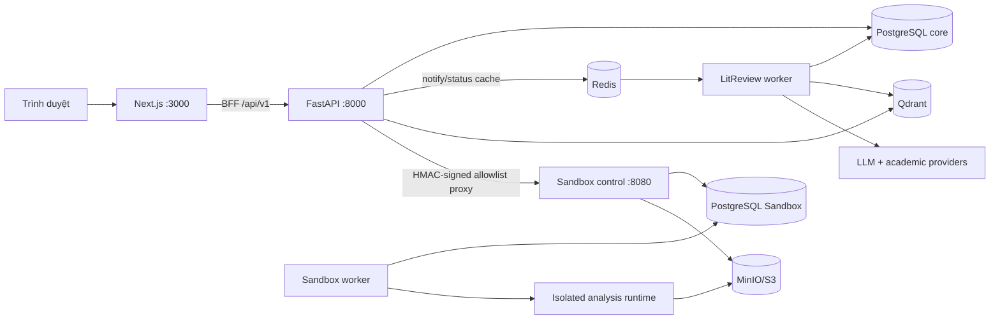

# Thông số kỹ thuật dự án LitReview (P-178)

> Tài liệu mô tả trạng thái **đã triển khai trong mã nguồn**, được đối chiếu tại nhánh `main`, commit `4fad4bb` (commit gần nhất ngày 2026-09-01). Roadmap và contract chỉ được dùng làm ngữ cảnh; khi có khác biệt, code, migration và test là nguồn xác thực ưu tiên.

## 1. Thông tin định danh

| Thuộc tính | Giá trị |
|---|---|
| Tên sản phẩm | LitReview |
| Mã dự án | AI20K Build Phase — P-178 |
| Package backend | `p-178` |
| Phiên bản backend/API | `0.1.0` |
| Package Sandbox | `research-experiment-sandbox` |
| Phiên bản Sandbox | `1.0.0` |
| Loại hệ thống | Nền tảng hỗ trợ nghiên cứu học thuật dựa trên bằng chứng |
| Kiến trúc | Web frontend + BFF/API + durable workers + PostgreSQL + Redis + Qdrant + Sandbox control plane |
| API public chính | REST/JSON, base path `/api/v1` |
| Định dạng dữ liệu API | JSON `snake_case`; thời gian ISO 8601 UTC |
| API schema | OpenAPI do FastAPI sinh tại `/docs` và `/openapi.json` |

Các capability chính:

- Literature Review Agent: tìm kiếm, chọn corpus, trích evidence, sinh claim và báo cáo có citation.
- Research Gap Detection: phát hiện gap chủ đề, phương pháp và mâu thuẫn; counter-search và chấm chất lượng.
- Document Review: tải PDF, phân tích, annotation, kiểm tra claim/citation, giải thích và rewrite.
- Research Copilot: workspace theo project, hội thoại, memory, action proposal và reviewer workflow.
- Research Sandbox: hypothesis, graph overlay và phân tích dataset trong runtime cô lập, có reviewer gate trước khi adoption.

## 2. Stack công nghệ và phiên bản

### 2.1 Backend và AI

| Thành phần | Phiên bản/ràng buộc | Vai trò |
|---|---:|---|
| Python | `>=3.12` trong `pyproject.toml` | Ngôn ngữ backend, worker và Sandbox |
| FastAPI | `>=0.115.0` | REST API, middleware, OpenAPI |
| Uvicorn | `>=0.34.0` | ASGI server |
| Pydantic | `>=2.10.0` | Request/response schema và validation |
| pydantic-settings | `>=2.7.0` | Cấu hình từ `.env` |
| LangChain | `>=0.3.0` | Lớp tích hợp LLM |
| LangGraph | `>=0.2.0` | Điều phối workflow agent |
| LangGraph PostgreSQL checkpoint | `>=2.0.0` | Checkpoint bền vững cho graph |
| SQLAlchemy | `>=2.0.0` | ORM/application persistence |
| psycopg / psycopg-pool | `>=3.2.0` | PostgreSQL driver và pool |
| Alembic | `>=1.13.0` | Migration database |
| Redis client | `>=5.2.0` | Queue notification/status cache |
| Qdrant client + FastEmbed | `1.16.2` trong `requirements.txt` | Vector indexing và local embedding fallback |
| Langfuse | `>=3.0.0` | Trace/observability LLM |
| pypdf | `>=6.14.2` trong `pyproject.toml` | PDF fallback parser |
| MarkItDown PDF | `>=0.1.3` | Chuyển đổi nội dung tài liệu |
| PyJWT crypto | `>=2.10.0` | Xác minh token Clerk |

Provider AI được hỗ trợ trong core: OpenAI, Google Gemini, Ollama, OpenCode và OpenRouter. Chế độ `auto` chỉ chọn provider đã có đủ cấu hình; nếu chọn provider cụ thể thì không tự chuyển provider khác.

### 2.2 Frontend

| Thành phần | Phiên bản | Ghi chú |
|---|---:|---|
| Node.js image | `24-alpine` | Build, development và production runner |
| Next.js | `^16.2.12` | App Router, standalone output |
| React / React DOM | `19.2.7` | UI runtime |
| TypeScript | `5.8.3` | `strict: true`, `noEmit: true`, target ES2017 |
| Clerk Next.js | `^7.6.4` | Đăng nhập và session frontend |
| Playwright | `^1.62.1` | Browser E2E |
| axe-core Playwright | `^4.13.0` | Kiểm tra accessibility trong E2E |

Frontend production được build thành Next.js standalone server và chạy bằng user không đặc quyền `nextjs` (UID 1001).

### 2.3 Data và hạ tầng

| Dịch vụ | Image/phiên bản | Chức năng | Tính chất dữ liệu |
|---|---|---|---|
| PostgreSQL core | `postgres:16-alpine` | Source of truth cho project, job, report, review và checkpoint | Bền vững |
| Redis | `redis:7-alpine` | Redis Streams đánh thức worker; cache status ngắn hạn | Có thể mất mà không mất job |
| Qdrant | `qdrant/qdrant:v1.16.2` | Semantic vector index | Có thể dựng lại |
| PostgreSQL Sandbox | `postgres:16-alpine` | State độc lập của Sandbox | Bền vững |
| MinIO | `RELEASE.2025-04-22T22-12-26Z` | Object storage cho dataset/artifact Sandbox | Bền vững |
| Docker Compose | Compose v2 | Local và production composition | Bắt buộc nếu chạy full stack |

## 3. Kiến trúc logic



Nguyên tắc sở hữu dữ liệu:

- PostgreSQL core là nguồn sự thật duy nhất cho dữ liệu ứng dụng và job; Redis không sở hữu job.
- Qdrant chỉ là index dẫn xuất, có thể rebuild từ paper/evidence đã lưu.
- Sandbox có database, migration, object storage và worker riêng; không ghi trực tiếp vào core graph.
- Trình duyệt không gọi trực tiếp Sandbox control. Mọi request đi qua BFF core, kiểm tra actor/project và ký HMAC.

## 4. Cấu trúc mã nguồn

```text
P-178/
├── src/
│   ├── agents/                 # LangGraph, node, prompt và academic tools
│   ├── api/routers/            # REST API core, copilot, document review, sandbox BFF
│   ├── db/                     # SQLAlchemy models và session
│   ├── models/schemas/         # Pydantic contracts
│   ├── services/               # LLM, jobs, search, retrieval, auth, review
│   ├── research_sandbox_service/ # Control plane, worker, runtime, migration riêng
│   ├── validation/             # Grounding validation
│   ├── main.py                 # FastAPI composition root
│   └── worker_main.py          # External worker entry point
├── frontend/                   # Next.js App Router và Playwright E2E
├── alembic/versions/           # 11 core migrations
├── tests/                      # Core unit/API/service/integration/E2E tests
├── benchmarks/                 # Gold sets, metrics, runner và reports
├── docs/                       # Product, architecture, operations, reference
├── docker-compose.yml          # Full local development stack
└── docker-compose-production.yml
```

Số liệu cấu trúc tại thời điểm tài liệu được lập:

| Hạng mục | Số lượng |
|---|---:|
| Module Python trong `src/` | 66 file |
| File test Python core trong `tests/` | 69 file |
| File TS/TSX/CSS trong `frontend/app/` | 48 file |
| Module Python trong `src/research_sandbox_service/sandbox_service/` | 79 file |
| Route decorator core | 86 |
| Route decorator Sandbox control | 56 |
| Bảng ORM core | 27 |
| Migration core | 11 revision (`0001`–`0011`) |
| Migration Sandbox | 8 revision (`s0001`–`s0008`) |

Các số lượng trên là snapshot code, không phải cam kết API ổn định.

## 5. Workflow AI

### 5.1 Literature review graph

Graph chính có 18 node:

```text
intent_guardrail
  ├─ out_of_scope → END
  └─ plan_search → review_subqueries [HITL]
       → search_academic_sources → assess_sources
       ├─ refine_query → search lại
       ├─ fail → END
       └─ screen_papers → review_papers [HITL]
            → extract_evidence → synthesize_claims
            → validate_grounding ↔ revise_claims
            → analyze_research_gaps
            → compose_literature_review
            → human_review → finalize → END
```

Thông số mặc định/giới hạn:

| Thông số | Mặc định | Miền hợp lệ |
|---|---:|---:|
| Corpus tối thiểu | 10 paper | 1–100 |
| Số lần tìm kiếm literature review | 2 | 1–10 |
| Số paper rank tối đa | 20 | 5–50 |
| Ngưỡng embedding relevance | 0,6 | 0–1 |
| Validation claim đồng thời | 5 | 1–50 |
| Full-text chunk mỗi paper | 4 | 1–20 |
| Compose attempts | 2 | 1–10 |
| LLM batch size | 8 | 1–20 |
| LLM retries | 3 | 0–10 |
| LLM timeout | 60 giây | 10–300 giây |
| LLM temperature mặc định | 0,0 | 0–2 |

Hai điểm dừng HITL đang hoạt động trong graph là duyệt `subqueries` và chọn `papers`. Node `human_review` cuối hiện tự đặt `approve`; API reviewer cuối vẫn tồn tại vì compatibility nhưng **chưa phải gate cưỡng chế** trong graph hiện tại.

### 5.2 Research-gap graph

Graph độc lập có 10 node: `extract`, ba detector chạy theo nhánh (topical/method/contradiction), `origin_labeling`, `verifier`, `counter_evidence`, `quality_scoring`, `deduplicate`, `synthesize`.

| Thông số | Mặc định | Miền hợp lệ |
|---|---:|---:|
| Corpus gap tối thiểu | 10 | 1–100 |
| Corpus gap tối đa | 20 | 1–100 |
| Số query tối đa | 4 | 1–10 |
| Snowball seed limit | 5 | 0–20 |
| Kết quả snowball tối đa | 10 | 0–50 |

### 5.3 Nguồn học thuật và retrieval

- Tìm kiếm song song qua OpenAlex, Semantic Scholar và arXiv.
- Metadata, DOI và URL phải đến từ provider, không lấy từ LLM output.
- Timeout request học thuật mặc định 20 giây, miền 3–60 giây.
- OpenAlex và Semantic Scholar retry mặc định 2 lần.
- Semantic Scholar được throttle tối thiểu 1,1 giây/request mặc định.
- Abstract tối thiểu mặc định 200 ký tự; arXiv tối đa 50 kết quả/request.
- Qdrant primary embedding mặc định: Gemini `models/gemini-embedding-001`, 3072 chiều.
- Fallback collection: `litreview_papers_fastembed`, model `BAAI/bge-small-en-v1.5`.
- Candidate pool mặc định 40, miền 5–100; Qdrant timeout 20 giây, miền 3–60 giây.

## 6. API kỹ thuật

### 6.1 Quy ước chung

- Public base path: `/api/v1`.
- Health check: `GET /health`; agent status: `GET /api/v1/status`.
- Authentication lấy actor từ trusted auth context; không tin `role`, `user_id` hoặc `reviewer_id` do client gửi.
- Project-scoped API kiểm tra membership và không cho truy cập chéo project.
- Mutation cần hỗ trợ `Idempotency-Key`; cùng key nhưng payload khác phải conflict.
- Error contract mục tiêu: `error_code`, `message`, `retryable`, `details`, `correlation_id`.
- Middleware tạo/nhận `X-Request-ID`, ghi thời lượng và trả lại header này.
- CORS cho phép danh sách từ `CORS_ORIGINS`, đồng thời thêm localhost/127.0.0.1 cổng 3000 và 8000.

### 6.2 Nhóm endpoint core

| Nhóm | Endpoint tiêu biểu | Chức năng |
|---|---|---|
| Literature review | `POST /reviews`, `GET /reviews/{job_id}`, `POST /reviews/{job_id}/resume` | Tạo, resume, theo dõi và lấy báo cáo |
| RAG trên paper | `POST /reviews/{job_id}/selected-papers/index`, `/query` | Index/query paper đã chọn |
| Evaluation/metrics | `/reviews/{job_id}/evaluation`, `/metrics/mvp` | Đánh giá và số liệu MVP |
| Auth | `/auth/session`, `/me`, `/webhooks/clerk` | Session local/test, identity, Clerk webhook |
| Project | `/projects`, `/projects/{project_id}`, `/members`, `/capabilities` | Workspace và RBAC |
| Research plan | `/projects/{project_id}/research-plans` | Lập và phê duyệt kế hoạch |
| Review/gap | `/projects/{project_id}/reviews`, `/research-gaps` | Durable background jobs |
| Collaboration | invitations, assignments, report versions, reviewer submissions | Quy trình reviewer |
| Copilot | conversations, messages, memories, action proposals | Chat có provenance và action gate |
| Document review | `/projects/{project_id}/document-reviews/...` | Upload, reanalyze, verify, explain, rewrite, apply |
| Sandbox BFF | `/projects/{project_id}/sandbox/capabilities`, `/open-session` | Proxy có allowlist sang Sandbox |

Frontend có route handler BFF tại `frontend/app/api/v1/[[...path]]/route.ts`; backend nội bộ mặc định `http://127.0.0.1:8000/api/v1` hoặc lấy từ `BACKEND_API_BASE_URL`.

## 7. Database và persistence

### 7.1 Core PostgreSQL

27 bảng ORM được chia thành:

- V1/review: `users`, `review_jobs`, `review_reports`, `review_decisions`, `reference_checks`, `report_reviews`, `evaluation_records`.
- Identity/project: `v2_actors`, `v2_sessions`, `v2_projects`, `v2_project_memberships`.
- Research/review: `v2_project_review_jobs`, `v2_research_plans`, `v2_report_versions`, `v2_project_invitations`, `v2_review_assignments`, `v2_review_submissions`.
- Copilot: `v2_conversations`, `v2_messages`, `v2_message_citations`, `v2_memories`, `v2_action_proposals`.
- Gap/audit/event: `v2_gaps`, `v2_gap_decisions`, `v2_reviewer_feedback`, `v2_audit_events`, `v2_events`.

Migration dùng Alembic. PostgreSQL cũng lưu LangGraph checkpoint; runtime không dùng SQLite.

### 7.2 Job runtime

| Thông số | Mặc định | Miền hợp lệ |
|---|---:|---:|
| Worker mode local | `embedded` | `embedded` / `external` |
| Worker concurrent jobs/process | 2 | 1–20 |
| Worker poll | 1 giây | 0,1–60 giây |
| Worker lease | 45 giây | 10–300 giây |
| Heartbeat | 10 giây | 1–60 giây |
| Redis stream block | 1000 ms | 100–60000 ms |
| Redis status TTL | 30 giây | 1–3600 giây |
| Active review đồng thời/project | 2 | Ràng buộc trong PostgreSQL |

API chỉ tạo row `queued`. Worker claim bằng database row lock, lease, heartbeat và execution fence. Redis Streams là kênh dispatch tăng tốc; nếu Redis lỗi, worker fallback sang PostgreSQL polling.

## 8. Document Review

| Thông số | Mặc định | Miền hợp lệ |
|---|---:|---:|
| Kích thước file tối đa | 20 MB | 1–100 MB |
| Số trang PDF tối đa | 60 | 1–500 |
| Source retention | 24 giờ | 1–720 giờ |
| Link check concurrency | 8 | 1–32 |
| Section critic tối đa | 20 | 1–100 |
| Critic concurrency | 4 | 1–16 |
| Suggestions tối đa | 12 | 1–50 |
| Citation verify tối đa | 50 | 1–150 |
| Citation verify concurrency | 4 | 1–16 |
| Claim pairs tối đa | 30 | 1–100 |
| Claim concurrency | 2 | 1–10 |
| Claim timeout | 90 giây | 5–120 giây |
| LLM call timeout | 30 giây | 5–300 giây |

PDF parser ưu tiên LlamaParse REST khi có key; nếu không có key thì fallback cục bộ bằng pypdf. Nhiệt độ mặc định: claim/critic `0.0`, explain `0.3`, rewrite `0.5`.

## 9. Research Sandbox

Sandbox bị tắt mặc định (`SANDBOX_ENABLED=false`) và fail-closed. Các capability con không thể vượt qua công tắc tổng.

### 9.1 Runtime security profile

| Giới hạn | Giá trị mặc định |
|---|---:|
| User trong runtime | `10001:10001` |
| CPU | 1 CPU |
| RAM | 2048 MB |
| PID | 32 |
| Thời gian chạy | 120 giây |
| Temporary disk | 1024 MB |
| Tổng output | 64 MB |
| Mỗi artifact | 16 MB |
| Số artifact | 50 |
| Log | 64 KB |
| Kill grace | 2 giây |
| Network | Tắt (`none`) |
| Root filesystem | Read-only |
| Linux capabilities | Drop toàn bộ |
| Privilege escalation | `no-new-privileges` |

Python sinh bởi AI phải qua AST code policy trước khi dispatch. Dataset/output dùng mount cố định; collector chặn path traversal, symlink, loại file lạ và vượt quota. Context, manifest, plan, code, result, artifact và bundle đều có hash; request/context snapshot được ký và chống replay.

### 9.2 Sandbox service defaults

| Thông số | Mặc định |
|---|---:|
| Control API nội bộ | `:8080` (host loopback `:8081`) |
| Worker probe | host loopback `:8090` |
| Sandbox PostgreSQL | host loopback `:5441` |
| MinIO console | host loopback `:9001` |
| Persistence khi chạy Compose | PostgreSQL |
| Object storage khi chạy Compose | S3-compatible MinIO |
| Worker poll | 1 giây |
| Worker lease | 180 giây |
| Control API ready check | `/readyz` |

## 10. Cấu hình môi trường

Không commit `.env` hoặc secret. Tạo cấu hình từ `.env.example`.

| Nhóm | Biến chính |
|---|---|
| App | `APP_ENV`, `APP_HOST`, `APP_PORT`, `LOG_LEVEL`, `CORS_ORIGINS` |
| Database | `DATABASE_URL`, `PRODUCT_DATABASE_URL`, `POSTGRES_HOST_PORT` |
| Worker/Redis | `WORKER_MODE`, `RUNTIME_ROLE`, `WORKER_MAX_CONCURRENT_JOBS`, `REDIS_ENABLED`, `REDIS_URL` |
| LLM | `LLM_PROVIDER`, `LLM_MODEL`, provider API keys/models, `LLM_FALLBACK_ORDER` |
| Academic search | `OPENALEX_EMAIL`, `OPENALEX_API_KEY`, `SEMANTIC_SCHOLAR_API_KEY` |
| Qdrant | `QDRANT_ENABLED`, `QDRANT_URL`, collections, embedding provider/model |
| Auth/email | Clerk issuer/JWKS/keys, `RESEND_API_KEY`, `RESEND_FROM_EMAIL` |
| Observability | `LANGFUSE_PUBLIC_KEY`, `LANGFUSE_SECRET_KEY`, `LANGFUSE_BASE_URL` |
| Document Review | `DOCUMENT_REVIEW_*` |
| Sandbox | `SANDBOX_ENABLED`, capability flags, HMAC/signing keys, runtime/storage settings |
| Frontend | `BACKEND_API_BASE_URL`, `NEXT_PUBLIC_API_BASE_URL`, `NEXT_PUBLIC_SITE_URL`, Clerk keys |

Secret chỉ được xử lý phía server. Structured logging phải redact credential, prompt, payload, feedback và raw provider error.

## 11. Network và port

| Cổng host local | Service | Exposure production Compose |
|---:|---|---|
| 3000 | Next.js frontend | Bind `127.0.0.1` |
| 8000 | FastAPI backend | Bind `127.0.0.1` |
| 5433 (mặc định) | PostgreSQL core | Bind `127.0.0.1` |
| 6333 | Qdrant HTTP/dashboard | Bind `127.0.0.1` |
| 5441 | PostgreSQL Sandbox | Luôn bind `127.0.0.1` |
| 8081 | Sandbox control | Luôn bind `127.0.0.1` |
| 8090 | Sandbox worker probe | Luôn bind `127.0.0.1` |
| 9001 | MinIO console | Luôn bind `127.0.0.1` |

Redis và MinIO data port không được publish ra host trong Compose hiện tại. Production dự kiến đặt reverse proxy/TLS phía trước frontend và API.

## 12. Build, chạy và kiểm thử

### 12.1 Full stack local

```powershell
Copy-Item .env.example .env
docker compose up --build
```

Địa chỉ kiểm tra:

- Frontend: <http://localhost:3000>
- API health: <http://localhost:8000/health>
- Swagger: <http://localhost:8000/docs>
- Qdrant dashboard: <http://localhost:6333/dashboard>

### 12.2 Chạy native

```powershell
uv sync
uv run uvicorn src.main:app --reload --host 0.0.0.0 --port 8000

Set-Location frontend
npm ci
npm run dev
```

Chạy native cần tự cung cấp PostgreSQL; Redis và Qdrant có thể bật/tắt theo cấu hình. `WORKER_MODE=embedded` khởi động worker trong process API.

### 12.3 Quality gates

```powershell
pytest tests/ -v
ruff check src/ tests/
ruff format --check src/ tests/

Set-Location frontend
npm run lint
npm run test:e2e
```

Make target `test` yêu cầu coverage tối thiểu 60%. Pytest dùng `asyncio_mode=auto`; marker chính gồm `gold`, `v2_4`, `external`, `browser`. Sandbox có các suite unit, contract, integration, security, scientific và E2E riêng.

Benchmark agent:

```powershell
python -m benchmarks selftest
python -m benchmarks run --only pos_01,neg_01 --label quick
python -m benchmarks run --repeat 2 --label full
```

## 13. Observability và vận hành

- Event family: `http.*`, `worker.*`, `job.*`, `llm.*`, `search.*`, `ingestion.*`, `retrieval.*`, `vector_store.*`, `agent.node_failed`.
- Async event gắn `job_id`, `run_id`, `request_id`; worker event thêm `worker_id`.
- Metric/event field chính: `duration_ms`, `papers_found`, `warning_count`, `indexed_chunks`, `failure_code`, `error_type`.
- Log local: `logs/backend.log`, `logs/worker.log`, `logs/frontend.log`, `logs/sandbox-control.log`, `logs/sandbox-worker.log`.
- Backend/worker/frontend local xoay log ở ngưỡng 524.288.000 byte (~500 MiB) theo cấu hình Compose.
- Alert khuyến nghị: `job.failed`, `llm.failed`, `search.provider_failed`, `worker.jobs_reclaimed`, tỷ lệ fallback tăng bất thường.

## 14. Bảo mật và tính toàn vẹn

Các invariant kỹ thuật bắt buộc:

1. Không có evidence hợp lệ thì không sinh factual claim.
2. Evidence quote phải exact-match với nội dung lưu trữ và có locator đúng `content_scope`.
3. LLM không được tự tạo paper ID, DOI, URL, citation, tool name hoặc quyền authorization.
4. User input, paper, PDF và dataset đều là untrusted content; prompt injection không được thay đổi policy.
5. Search, retry, loop và execution đều bounded, có timeout và trace.
6. Mutation, ingestion và code execution cần actor, permission, idempotency và audit.
7. Reviewer decision đi qua Reviewer API, không expose như generic LLM tool.
8. Artifact thay đổi phải tạo immutable version mới.
9. Dữ liệu ngoài project không được đọc, retrieve, trích dẫn hoặc ghi memory.
10. Numeric/data-analysis claim dùng AnalysisArtifact provenance; literature claim dùng paper/evidence provenance.

## 15. Sai lệch và giới hạn kỹ thuật hiện tại

| Vấn đề | Trạng thái/ảnh hưởng |
|---|---|
| Python version | `pyproject.toml` yêu cầu Python `>=3.12`, nhưng backend `Dockerfile` dùng Python 3.11 và Ruff target `py311`. Cần đồng bộ trước khi coi 3.12 là runtime chuẩn tuyệt đối. |
| Final reviewer gate | API/schema còn tồn tại nhưng node cuối trong literature graph đang tự approve; chưa cưỡng chế reviewer approval sau khi graph hoàn tất. |
| Sandbox mặc định | Toàn bộ capability tắt và fail-closed; có module không đồng nghĩa feature đã bật ở production. |
| Resource sizing core | Compose chưa đặt CPU/RAM limit cho backend, worker, database, Redis, Qdrant và frontend. Không nên diễn giải cấu hình hiện tại thành yêu cầu phần cứng chính thức. |
| Redis/Qdrant | Là thành phần tăng tốc/dẫn xuất, không được dùng thay PostgreSQL source of truth. |
| Production adapters Sandbox | Phải cung cấp implementation thực cho Project AI, graph snapshot reader và approved adoption sink, cùng key/digest/hash production hợp lệ. |

## 16. Nguồn đối chiếu

- `README.md`, `pyproject.toml`, `requirements.txt`
- `src/config.py`, `src/main.py`, `src/worker_main.py`
- `src/agents/graph.py`, `src/agents/research_gap_graph.py`
- `src/api/routers/`, `src/db/models.py`
- `frontend/package.json`, `frontend/Dockerfile`, `frontend/tsconfig.json`
- `docker-compose.yml`, `docker-compose-production.yml`
- `src/research_sandbox_service/pyproject.toml`, `src/research_sandbox_service/docker-compose.sandbox.yml`
- `src/research_sandbox_service/sandbox_service/execution/runner.py`
- `docs/architecture/AGENT_STATE_GRAPH.md`
- `docs/operations/WORKER_RUNTIME.md`
- `docs/reference/README_technical_contract.md`

---

**Quy tắc cập nhật:** khi thay đổi dependency, environment variable, port, migration, API contract, worker limit, graph node hoặc Sandbox security profile, cập nhật file này trong cùng pull request.
