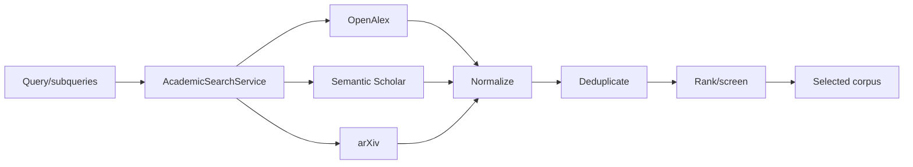

# Academic Search and Ingestion Reference

> Tài liệu mô tả adapter đang chạy trong `src/services/academic_search.py`, `paper_ingestion.py` và `vector_store.py`, cập nhật 2026-09-01.

## 1. Phạm vi hiện tại

`AcademicSearchService.search_all_sources()` tìm song song từ ba nguồn rồi
normalize và deduplicate. `search()` là helper OpenAlex-only cho các lookup hẹp;
main literature-review tool và research-gap service dùng `search_all_sources()`.

| Provider | Search format | API key | Vai trò |
|---|---|---|---|
| OpenAlex | JSON | Email/key tùy cấu hình và quota | Metadata, abstract, citation/open-access signals |
| Semantic Scholar | JSON | Tùy chọn nhưng nên có để tăng quota | Metadata, abstract, citation và open-access PDF signal |
| arXiv | Atom XML | Không | Preprint metadata, abstract và PDF URL |

Các contract V1 OpenAlex-only là baseline lịch sử. Runtime hiện tại đã là multi-source; tài liệu hoặc roadmap nói arXiv/Qdrant “chưa triển khai” không đại diện cho code đang chạy.

## 2. Paper model

Schema thực nằm tại `src/agents/state.py` và `src/models/schemas/literature_reviews.py`. Các field quan trọng gồm:

```text
paper_id, source, title, authors, year, doi, url,
abstract, cited_by_count, is_open_access, pdf_url
```

Quy tắc:

- `source` thuộc `openalex`, `semantic_scholar`, `arxiv`.
- Metadata, DOI và URL lấy từ provider response, không từ LLM.
- Abstract phải đạt `ACADEMIC_MIN_ABSTRACT_LENGTH` sau normalize.
- Deduplicate ưu tiên DOI và identity/title đã chuẩn hóa.
- Thiếu field không được bịa. Schema hiện giữ `cited_by_count` dạng số; giá trị
  mặc định của nguồn không cung cấp citation không được diễn giải như một phép
  đo citation đã quan sát.

## 3. Search flow



Provider failure được gom theo source; service có thể trả kết quả từ nguồn còn lại. Retry, timeout, rate-limit và minimum abstract length lấy từ `src/config.py`, không hardcode trong tài liệu.

## 4. Provider mapping

### OpenAlex

- Work ID được normalize từ OpenAlex ID.
- Abstract inverted index được dựng lại theo token positions.
- DOI/URL/open-access/citation count lấy từ work metadata.
- `OPENALEX_EMAIL` và `OPENALEX_API_KEY` chỉ cấu hình ở backend.

### Semantic Scholar

- Adapter dùng Graph API search response và map paper ID/DOI/URL/abstract.
- `SEMANTIC_SCHOLAR_API_KEY` là tùy chọn nhưng rate limit nghiêm hơn khi không có key.
- Shared deployment phải điều phối rate limit giữa worker replicas.

### arXiv

- Adapter parse Atom XML và tạo ID có prefix `arxiv:`.
- DOI chuẩn có thể dùng dạng `10.48550/arXiv.<id>` khi code/provider cung cấp.
- `pdf_url` trỏ tới arXiv PDF; citation count không được suy diễn như một metric tương đương OpenAlex.

## 5. Full-text ingestion

```text
selected paper
→ kiểm tra URL/provider/license/availability
→ tải PDF với timeout và size guard
→ parse thành Markdown/structured text
→ chunk có locator/provenance
→ embed
→ upsert Qdrant theo job/corpus scope
```

PDF trong `PAPER_STORAGE_DIR` là cache có thể tải lại. Qdrant là derived index có thể dựng lại. PostgreSQL vẫn lưu job, report, evidence/reviewer state và checkpoint.

Khi full text không khả dụng, workflow có thể dùng abstract theo content scope. UI/report phải cho biết evidence đến từ abstract hay full text; không gắn section/page giả.

## 6. Grounding rules

1. Claim chỉ tham chiếu paper thuộc corpus/job hiện tại.
2. Evidence quote/locator phải khớp content đã lưu hoặc retrieved chunk.
3. Source URL/DOI không được tạo bởi model.
4. Unsupported/uncertain claim phải bị narrow, revise, discard hoặc hiển thị verdict phù hợp.
5. Candidate research gap phải giữ support, counter-evidence, confidence và phạm vi corpus.

## 7. Configuration

| Nhóm | Biến chính |
|---|---|
| OpenAlex | `OPENALEX_EMAIL`, `OPENALEX_API_KEY`, retry settings |
| Semantic Scholar | `SEMANTIC_SCHOLAR_API_KEY`, retry/min-interval settings |
| arXiv | `ACADEMIC_ARXIV_MAX_RESULTS` |
| Shared validation | `ACADEMIC_REQUEST_TIMEOUT`, `ACADEMIC_MIN_ABSTRACT_LENGTH` |
| Qdrant | `QDRANT_ENABLED`, URL/key/collections, embedding provider/model |
| File cache | `PAPER_STORAGE_DIR` |

Giá trị mặc định chính xác xem `.env.example` và `src/config.py`.

## 8. Error behavior

| Trường hợp | Expected behavior |
|---|---|
| Một provider timeout/5xx | Bounded retry; giữ kết quả nguồn khác nếu đủ |
| 429 | Backoff/rate-limit theo provider |
| Metadata/abstract invalid | Loại record trước khi gọi LLM |
| Không có full text | Giữ metadata/abstract, ghi đúng content scope |
| Qdrant lỗi | Dùng fallback được cấu hình hoặc fail typed; không mất PostgreSQL record |
| Corpus quá nhỏ | Refine/counter-search có giới hạn hoặc trả insufficient evidence |

Unit test nên mock JSON/XML/provider errors. Test gọi mạng phải tách khỏi test mặc định để tránh phụ thuộc external availability.

## 9. Source of truth

- Adapter và dedup: `src/services/academic_search.py`
- Ingestion: `src/services/paper_ingestion.py`
- Vector retrieval: `src/services/vector_store.py`
- Settings: `src/config.py`
- Main flow: [AGENT_STATE_GRAPH.md](../architecture/AGENT_STATE_GRAPH.md)
- Research gap: [RESEARCH_GAP_FLOW.md](../architecture/RESEARCH_GAP_FLOW.md)
